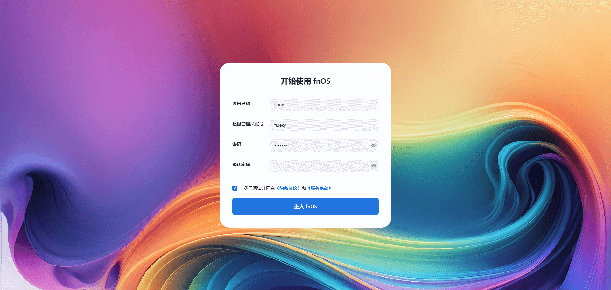

## 下载镜像

目前最新版本 [0.8.4](https://download.liveupdate.fnnas.com/x86_64/trim/fnos.0.8.24-469.iso)。

## 制作引导盘

推荐使用 Ventoy ，详细使用见此文档。

## 安装 FnOS

### 虚拟机

如果是研究或练习使用 飞牛私有云， 建议先通过 VirtualBox 安装使用。关于怎样使用 VirtualBox 见此文档。

#### 新建虚拟机

- 选择需要的镜像文件和系统类型， FnOS 是基于 Debian 开发的，因此此处可选 Debian。

- 设置硬件信息， 最低 2 核 4G 内存可确保系统稳定运行。 1核 2G 也可。

- 创建虚拟硬盘，建议 200G。将根据实际文件大小，动态分配硬盘空间。

- 基本配置完成后，结果如下图所示。

#### 配置虚拟机

- 修改引导顺序，硬盘第一，光驱第二，软驱不用选。 未安装系统时，将按照顺位从光驱启动。

- 设置网络未桥接模式，这样局域网内其他设备也可访问此虚拟机。

### 实体机

将 U 盘插入机器中，并选择从 U 盘启动。选择 fnos iso 文件后，进入安装页面。

下面的安装步骤和界面，虚拟机与实体机完全一致。

- 选择需要安装的硬盘

- 系统分区和交换空间，建议使用默认值。如需要在 FnOS中装很多应用服务，建议分配更大空间。

- 格式化硬盘确认，此处慎重。

- 执行安装步骤。

- 系统安装完成。

- 选择网卡，通常只能插上网线。

- 提示网络保存成功。

- 安装完成后进入系统。

- 根据提示的地址，在浏览器中打开。

- 设置好 root 账户和密码。

- 提示创建存储空间。

