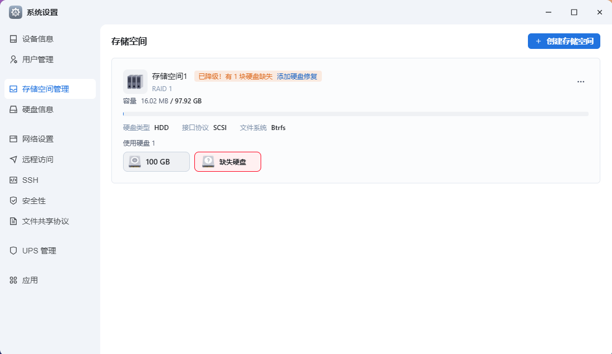
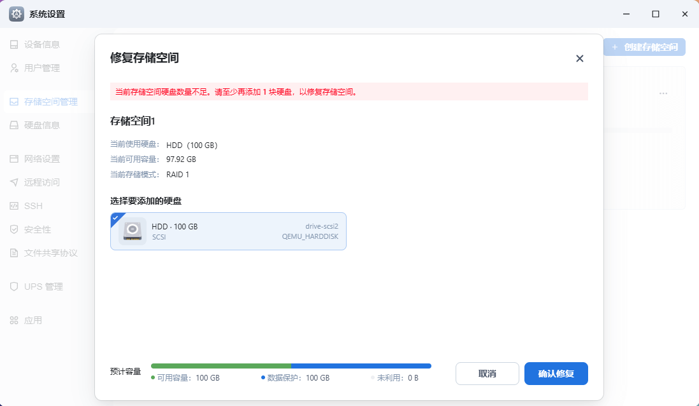
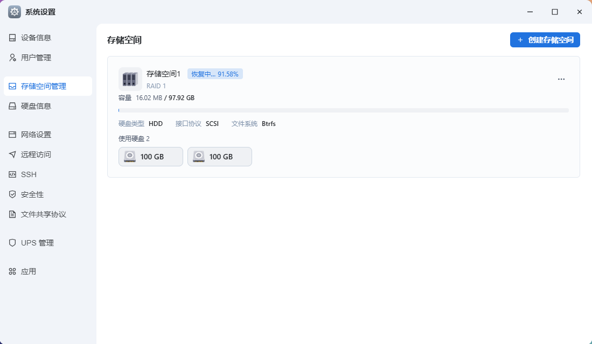

## 修复硬盘

> [!tip]
> 通过 PVE 中安装的飞牛系统，删减硬盘，模拟硬盘损坏情况。经验证发现，缺失硬盘将无法从网页进入系统，需要替换一块新的硬盘。

由于使用的是 raid1 ，因此在缺失一块硬盘的情况下，另外硬盘的数据仍然可以无损访问。

- 打开存储空间，可见硬盘缺失，提醒修复 

- 自动检测到新的可用硬盘，建议仍然选用大小一样的硬盘

- 恢复时长，取决于已使用空间大小

