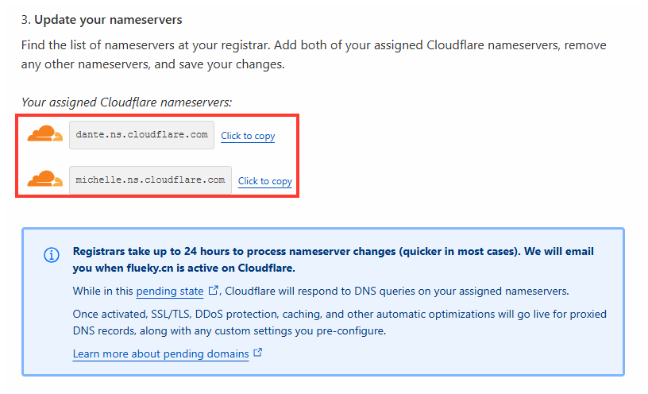

## IPv4

获取 IPv4 需要向网络运营商申请，一般只有专线网络会批准。据说，电信可以给个人用户分配公网 IPv4 地址。未验证。

## IPv6

相比较 IPv4，IPv6 多到可以给地球上个每粒沙子分配一个地址。如果你家的网络不支持 IPv6， 绝对可以找运营商 battle 。

可通过下面两个网站查询公网 ip 地址，以及是否支持 IPv6

- https://ipw.cn/
- http://ipv6-test.ch/
- https://test-ipv6.com/ 国外站点

在命令行界面，可直接通过如下命令获取公网 IP。

```shell
curl 4.ipw.cn # 获取 IPv4
curl 6.ipw.cn # 获取 IPv6
```

> [!tip]
> 只有都支持 IPv6 的设备才能相互访问。因此，如果 DNS 解析到 IPv6 地址，该站点将只支持 IPv6 的方式访问。

## 域名

通过公网 IP 访问远程设备终归是不方便的。尤其是复杂冗长的 IPv6 地址更加难以记住。因此在 [阿里云](https://www.aliyun.com/) 花了 188 买了 10年 flueky.top 二级域名 。

### 阿里云

https://wanwang.aliyun.com/ 

## DNS解析

固定 IP 或多个 IP 可直接在平台上绑定。如是动态 IP， 需要用到 DDNS 。

### 阿里云


### CloudFlare

[CloudFlare](https://www.cloudflare.com/) 可以注册域名，也可以为域名做托管服务，即用 CloudFlare 的 DNS 域名，配置在域名服务提供商，此处是阿里云。

- 输入需要托管的域名


- 选择服务，免费的就好


- 生成的 DNS 地址，添加到阿里云



- 阿里云上修改新的 DNS 地址


## 内网穿透


