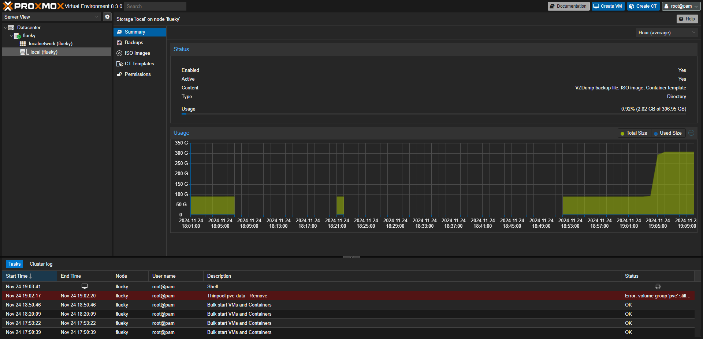

## 更新源

> [!tip]
> 更新软件源，主要是访问系统官网国外站点更新或安装软件比较慢。国内软件源一般推荐 [清华](https://mirrors.tuna.tsinghua.edu.cn/help/) 或 [科大](https://mirrors.ustc.edu.cn/help/) 的镜像源。

PVE 是在 Debian 的基础上开发的，所以更新软件源的方式按照 Debian 标准执行。

打开镜像站点，找到 Debian， 然后按照文档中提示修改 `/etc/apt/sources.list`。 但更推荐如下方式，更为简单。

```shell
cat /etc/apt/sources.list # 检查 源文件中的域名地址，比如这里是 ftp.debian.org
# 替换成目标镜像源的域名
sed -i 's/ftp.debian.org/mirrors.ustc.edu.cn/g' /etc/apt/sources.list
# 替换源后，更新 apt
apt update
```

## 连接 WiFI

在安装 PVE 的时候，主机需要连接网线，通过 DHCP 的方式获得 IP 地址。在安装完成后，即可通过这个 IP 地址访问 PVE ，并且 PVE 也可访问到外网。若使 PVE 接入 WiFi ，还需要添加一些额外的操作。

### 安装依赖程序

```shell
# vim 可替换成熟悉的命令行工具，也可直接用系统自带的 vi 或 nano 工具
apt install vim wpasupplicant wireless-tools
```

### 添加配置文件

将上面的内容写进 `/etc/wpa_supplicant/wpa_supplicant.conf` 文件， ssid 是 wifi 账号， psk 是密码，保留引号

```
network={
     ssid="YourSSID"
     psk="YourPassword"
}
```

```shell
ip link # 查看网卡设备名称， wl 开头的是 无线设备（wireless）
# 连接 WiFi，wlp1s0 替换成你主机的 无线网卡
wpa_supplicant -B -i wlp1s0 -c /etc/wpa_supplicant/wpa_supplicant.conf
# 分配 ip 地址
dhclient wlp1s0
# 检查获取到的 ip 地址
ip addr show
```

### 自动连接

- 开机自启服务

```shell
systemctl enable wpa_supplicant
```

- 动态 IP

修改 `/etc/network/interfaces` 添加如下内容。

```
auto wlp1s0
iface wlp1s0 inet dhcp
wpa-conf /etc/wpa_supplicant/wpa_supplicant.conf
```

- 静态 IP

修改 `/etc/network/interfaces` 添加如下内容。IP 地址，子网掩码，网关信息需要根据路由器实际的配置填写。

```
auto wlp1s0
iface wlp1s0 inet static
address 192.168.1.100
netmask 255.255.255.0
gateway 192.168.1.1
wpa-conf /etc/wpa_supplicant/wpa_supplicant.conf
```

最后，应用配置。

```shell
# 重启网络服务
systemctl restart networking
# 重启电脑
reboot
```

### 强迫症选项

当 PVE 的网卡能够获取到 IP 后（`ip addr show` 可查看全部 IP）， 可以用任意 IP 访问 PVE 主机，前提是你的电脑和 PVE 处于同一个局域网下。

此时在开机屏幕上给提示的 IP 地址可能不是你想要的。只需要修改 `/etc/hosts` 文件就可。

## 修改 DNS

修改 `/etc/resolv.conf`

```
nameserver 192.168.3.1 # 路由器地址
# 或者如下通用地址
nameserver 8.8.8.8
nameserver 114.114.114.114
```

## 删除 LVM

> [!important]
> 仅供学习研究，不建议在正式环境下使用。

LVM 在 linux 中具备如下作用。

- 动态调整存储空间：LVM允许在不需要重新分区物理磁盘的情况下动态调整逻辑卷的大小。
- 快照：LVM支持创建快照，这有助于进行备份和恢复操作。
- 条带化：LVM可以通过条带化技术提高I/O性能。
- 简化存储管理：LVM提供了一个统一的接口来管理物理存储设备上的逻辑卷。

如果磁盘空间有限，且不需要 LVM 具备的一些功能，可以删除。具体方式如下：


右上角，点击更多按钮，出现销毁选项。点击即可删除。


确认界面，输入磁盘 id。完成删除操作。还需要执行一些命令，将剩出来的空间全部给 `local` 。

```shell
# 将剩余空间，全部分配给 local
lvresize --extents +100%FREE --resizefs pve/root
# 重新执行 4k 对齐
resize2fs /dev/mapper/pve-root
```

最后如图所示，即完成全部操作。



## 去除登录弹框

```shell
sed -i_orig "s/data.status === 'Active'/true/g" /usr/share/pve-manager/js/pvemanagerlib.js
sed -i_orig "s/if (res === null || res === undefined || \!res || res/if(/g" /usr/share/javascript/proxmox-widget-toolkit/proxmoxlib.js
sed -i_orig "s/.data.status.toLowerCase() !== 'active'/false/g" /usr/share/javascript/proxmox-widget-toolkit/proxmoxlib.js
systemctl restart pveproxy
```

由于是修改了 js 文件，因此可能需要清除浏览器缓存，才能生效。

## 开启 PCIe 直通 [^1]

[^1]: 参考文档：https://blog.csdn.net/Y525698136/article/details/143749739

- 确认 CPU 和主板支持 IOMMU。
     - Intel：支持 VT-d（Intel Virtualization Technology for Directed I/O）。
     - AMD：支持 AMD-Vi。
- 进入 BIOS/UEFI，确保启用了 VT-d（Intel）或 AMD-Vi（AMD）。

### 术语

IOMMU ： 输入输出内存管理单元。一种主机硬件机制，主要用于管理I/O设备（如图形卡、网络卡和存储设备等）对系统内存的访问。
‌SR-IOV（Single Root I/O Virtualization）是一种I/O虚拟化技术，旨在通过硬件支持，将单个PCI Express（PCIe）设备虚拟化为多个独立的虚拟设备，以提高资源利用率和性能‌‌。
‌X2APIC‌: 是高级可编程中断控制器（APIC）的一种版本，主要用于x86架构中的中断处理。X2APIC是Intel在Pentium 4和Xeon处理器中引入的一种APIC版本，用于替代早期的APIC版本，如APIC和xAPIC。
VFIO（Virtual Function I/O）：是 Linux 内核中的一个框架，用于将硬件设备直接分配给虚拟机或用户空间应用程序，允许这些设备以接近本地性能的方式被完全控制。

### IOMMU

`vim /etc/default/grub` 更新后，执行 `update-grub` 

```shell
# 修改 GRUB_CMDLINE_LINUX_DEFAULT 配置为
GRUB_CMDLINE_LINUX_DEFAULT="quiet intel_iommu=on iommu=pt initcall_blacklist=sysfb_init pcie_acs_override=downstream"
#注意：pve 7.2 以前版本使用
GRUB_CMDLINE_LINUX_DEFAULT="quiet intel_iommu=on iommu=pt video=efifb:off,vesafb:off pcie_acs_override=downstream"
```

> 说明：
> intel_iommu=on 开启IOMMU, AMD CPU 用 amd_iommu=on
> iommu=pt 让内核驱动设备性能更高，并且防止Linux将不能直通的设备直通
> initcall_blacklist=sysfb_init 替代老版本中的 `video=efifb:off,vesafb:off` [参考文档](https://forum.proxmox.com/threads/pci-gpu-passthrough-on-proxmox-ve-8-installation-and-configuration.130218/)。
> pcie_acs_override=downstream 用于将iommu groups拆分，方便一些板载设备的直通 [参考文档](https://github.com/ivanhao/pvetools/issues/34)。

加载对应的模块。

```shell
echo vfio >> /etc/modules
echo vfio_pci >> /etc/modules
echo vfio_iommu_type1 >> /etc/modules
# echo vfio_virqfd >> /etc/modules # pve8 不需要配置
```

重启后，验证结果。

```shell
# DMAR: IOMMU enabled
dmesg | grep -E "DMAR|IOMMU"
# VFIO - User Level meta-driver version: 0.3
dmesg | grep -i vfio
# DMAR-IR: Queued invalidation will be enabled to support x2apic and Intr-remapping.
# DMAR-IR: Enabled IRQ remapping in x2apic mode
dmesg | grep 'remapping'
```

### 显卡直通

```shell
# 直通 NVIDIA 显卡，请使用下面命令
echo "# NVIDIA" >> /etc/modprobe.d/blacklist.conf 
echo "blacklist nouveau" >> /etc/modprobe.d/blacklist.conf 
echo "blacklist nvidia" >> /etc/modprobe.d/blacklist.conf 
echo "blacklist nvidiafb" >> /etc/modprobe.d/blacklist.conf
echo "blacklist nvidia_drm" >> /etc/modprobe.d/blacklist.conf
echo "" >> /etc/modprobe.d/blacklist.conf
​
# 直通 AMD 显卡，请使用下面命令
echo "# AMD" >> /etc/modprobe.d/blacklist.conf
echo "blacklist amdgpu" >> /etc/modprobe.d/blacklist.conf
echo "blacklist radeon" >> /etc/modprobe.d/blacklist.conf

# 允许不安全的中断
echo "options vfio_iommu_type1 allow_unsafe_interrupts=1" > /etc/modprobe.d/iommu_unsafe_interrupts.conf
# 忽略异常，防止虚拟机异常导致宿主机崩溃
#   ignore_msrs             :   忽略异常
#   report_ignored_msrs     :   是否报告异常
echo "options kvm ignore_msrs=1 report_ignored_msrs=0" > /etc/modprobe.d/kvm.conf
# 更新内核引导文件
update-initramfs -k all -u
```

## PVE Sources

## PVE Tools

## 降 Linux 内核

## 硬盘直通