## 下载镜像

目前最新版本 [8.3](https://enterprise.proxmox.com/iso/proxmox-ve_8.3-1.iso)

## 制作引导盘

推荐使用 [Ventoy](https://www.ventoy.net/), 这是我目前见过最轻量，兼容性最好的 制作 USB 启动盘的共工具。

可同时将多个系统的镜像文件拷入 Ventoy 制作好的启动盘中。 盗用一张来自官网的图片。

## 安装 PVE

### 虚拟机

如果还不熟悉 PVE 系统的安装与使用，可先通过 VirtualBox 虚拟机练手。关于怎样使用 VirtualBox，见 [此文档](/virtualbox.md)。

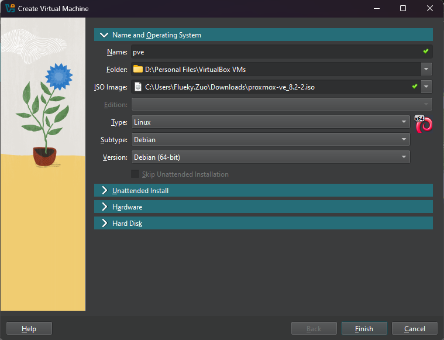
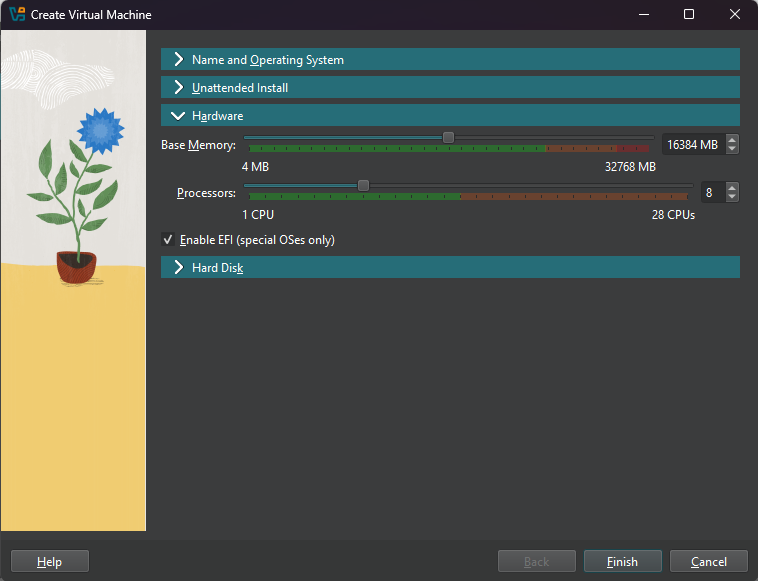
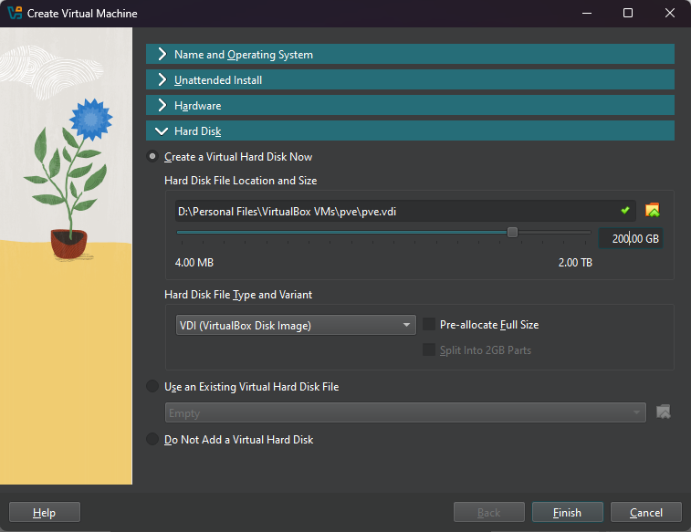

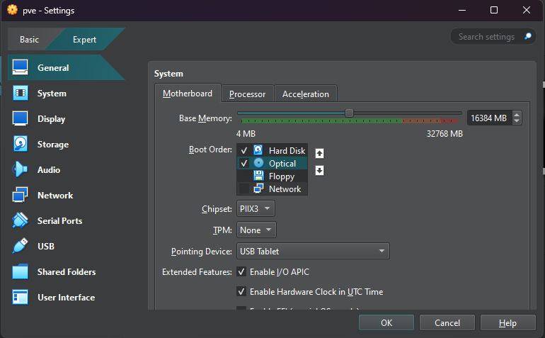
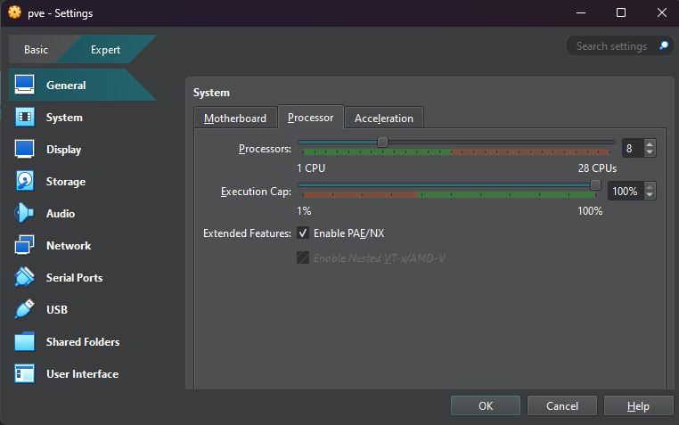
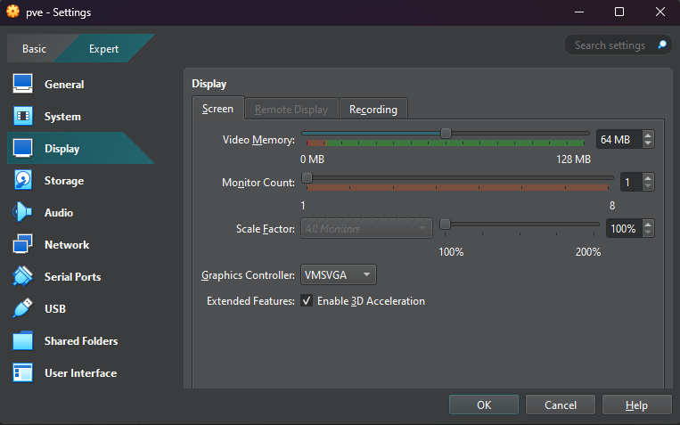
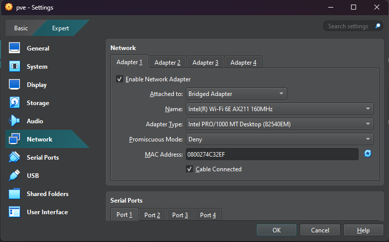

做好以上配置后，即可启动虚拟机。

### 实体机

将 U 盘插入机器中，并选择从 U 盘启动。选择 proxmox iso 文件后，进入安装页面。

下面的安装步骤和界面，虚拟机与实体机完全一致。

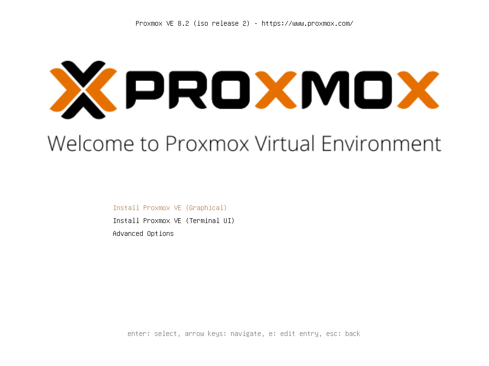
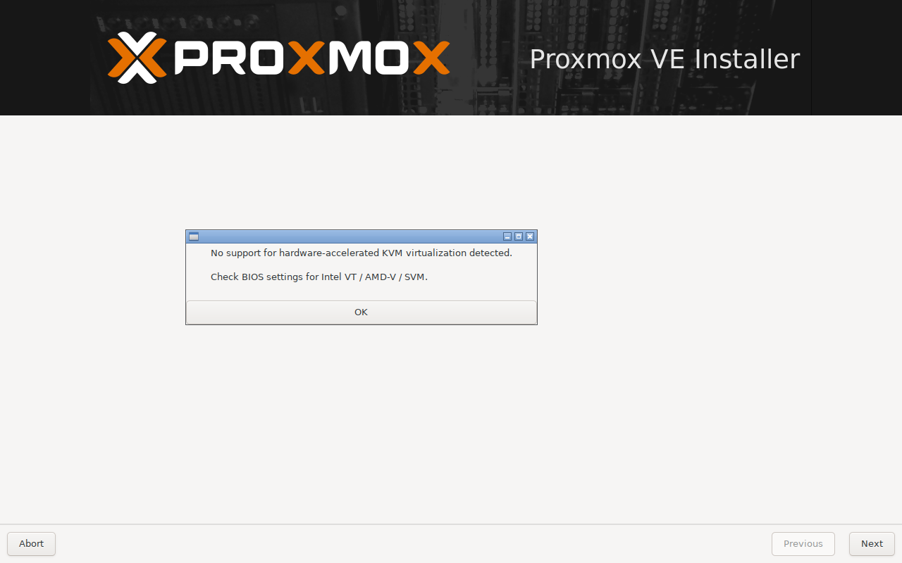
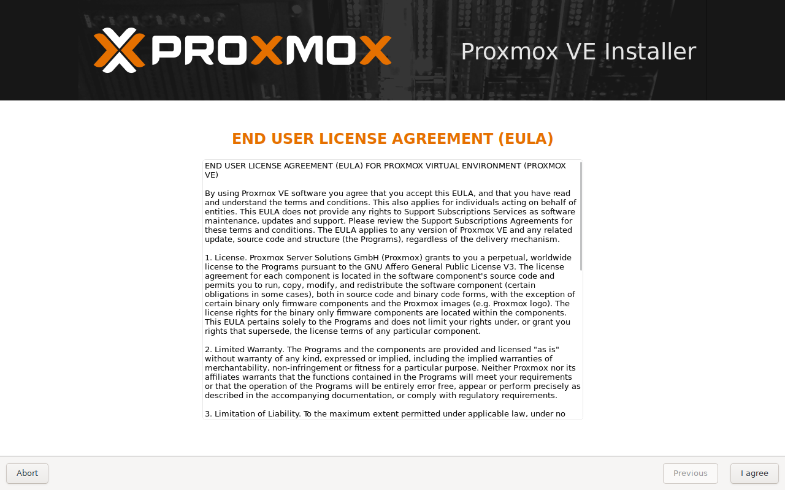
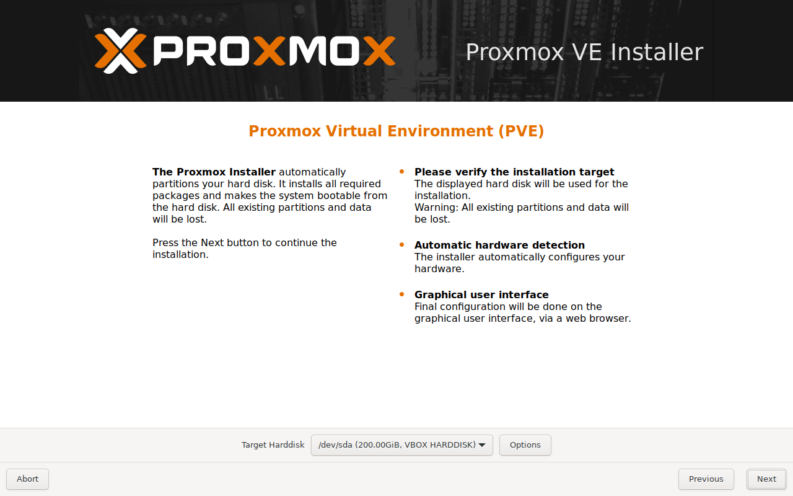
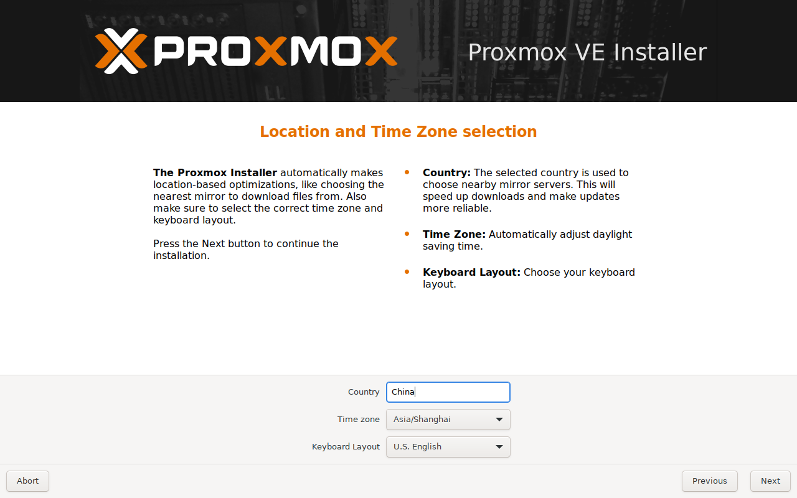
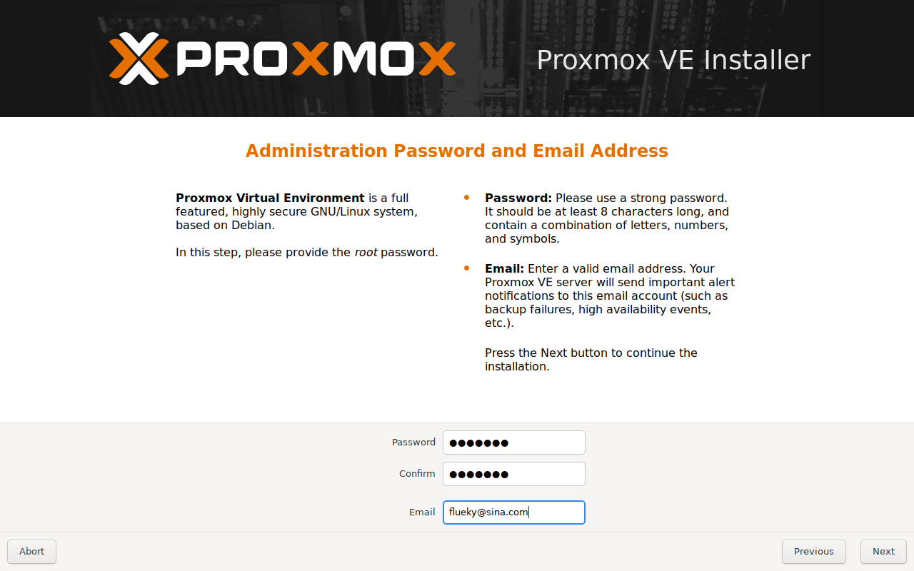
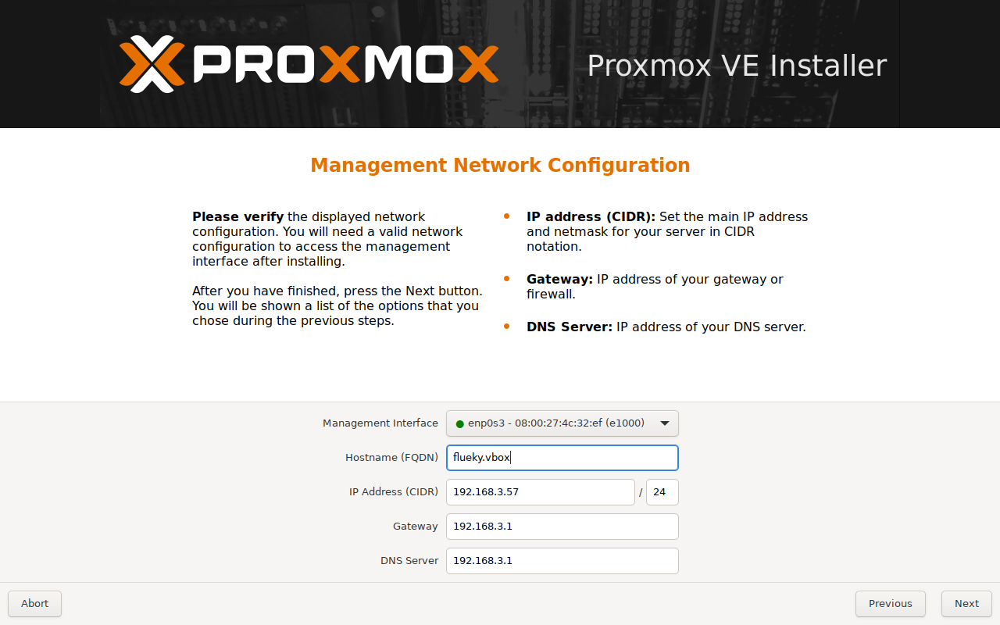
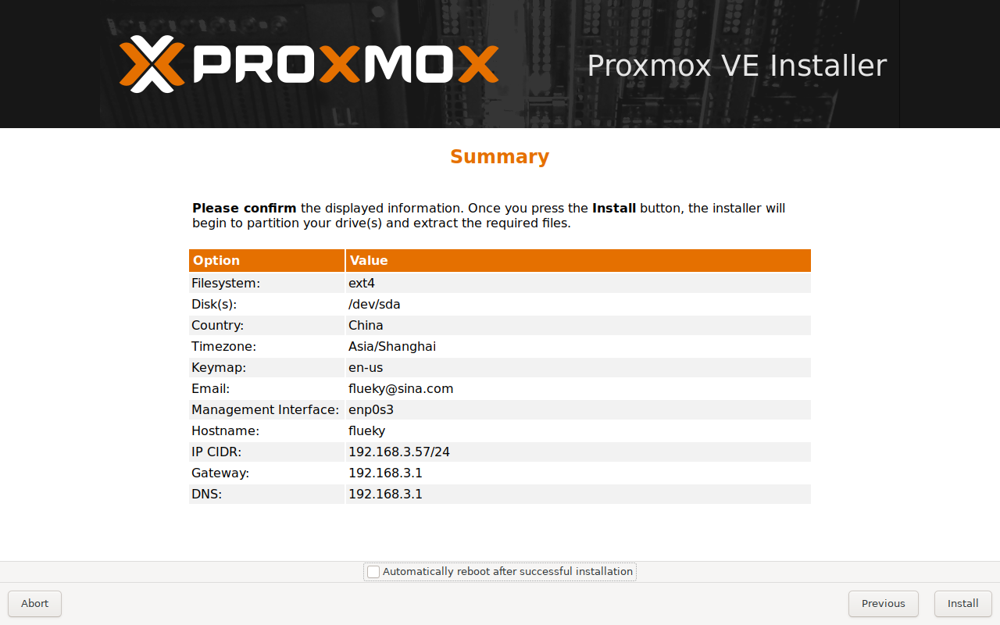
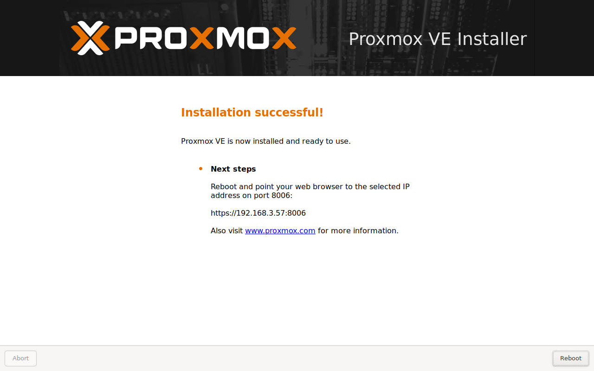

## 启动 PVE

成功进入系统后，在屏幕上显示出了访问地址。后续操作和配置均可通过浏览器远程访问。

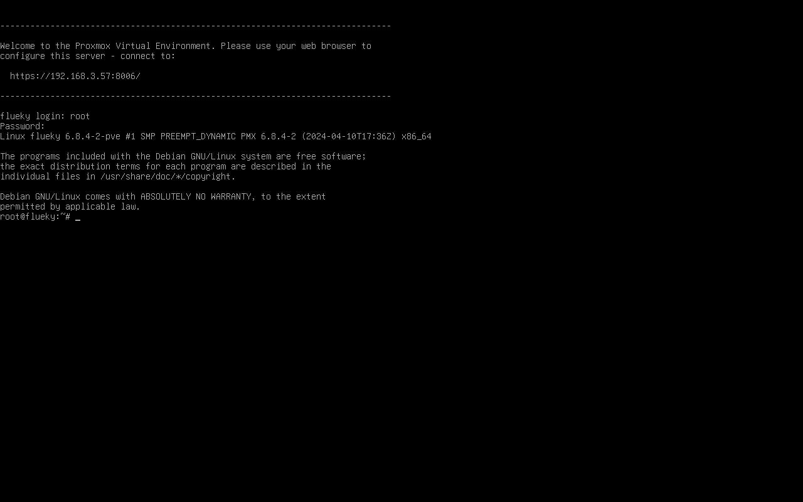

登录 PVE 系统，要求输入用户： root， 密码： 安装系统时设置的。

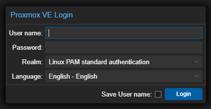

最后看到完整管理界面如图

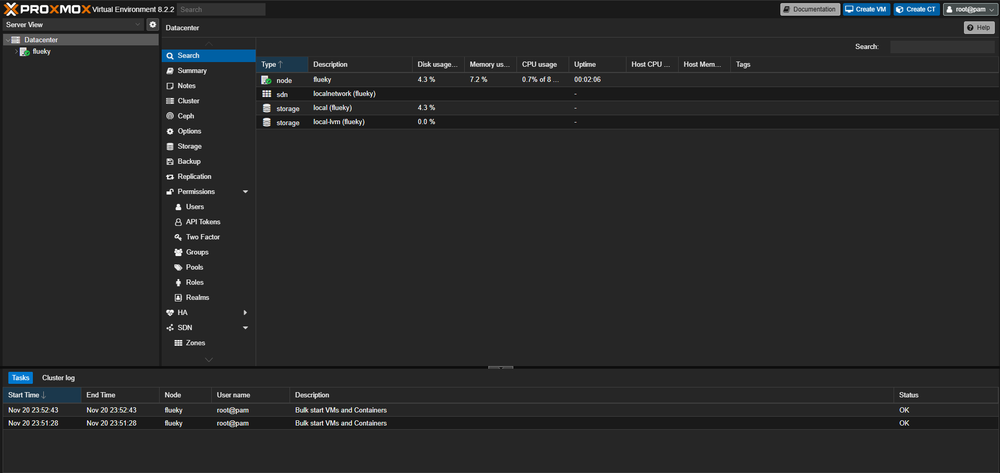