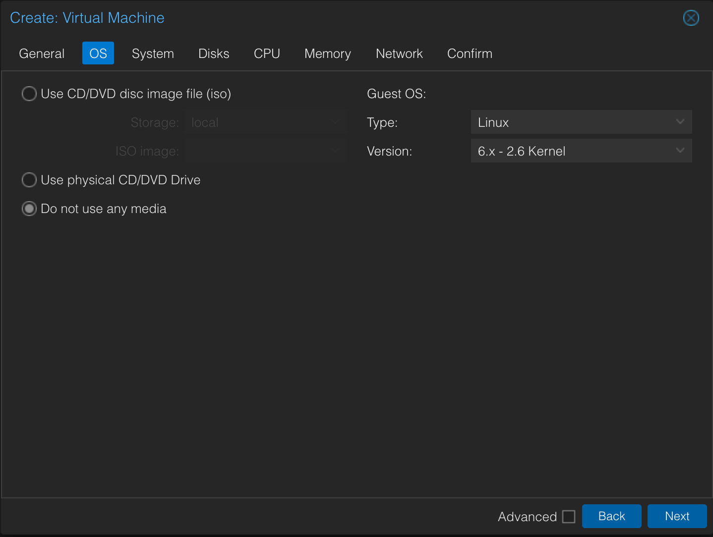
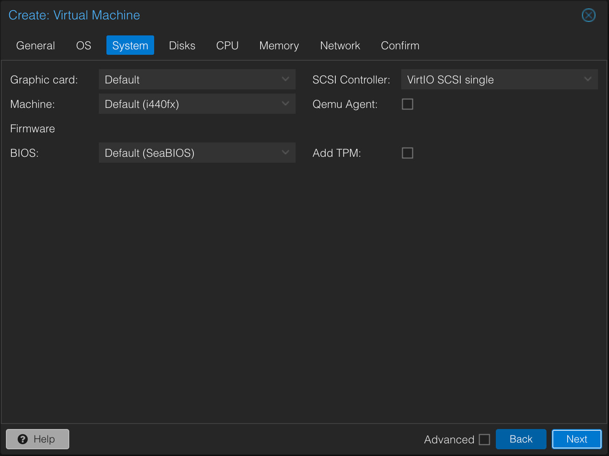
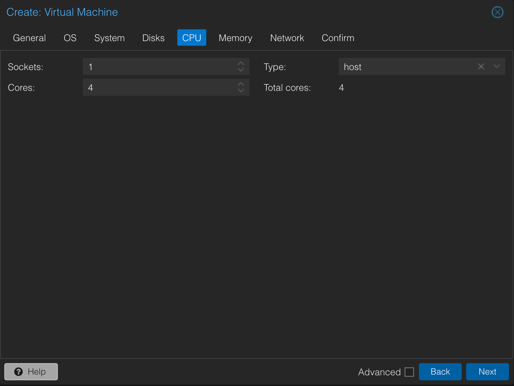
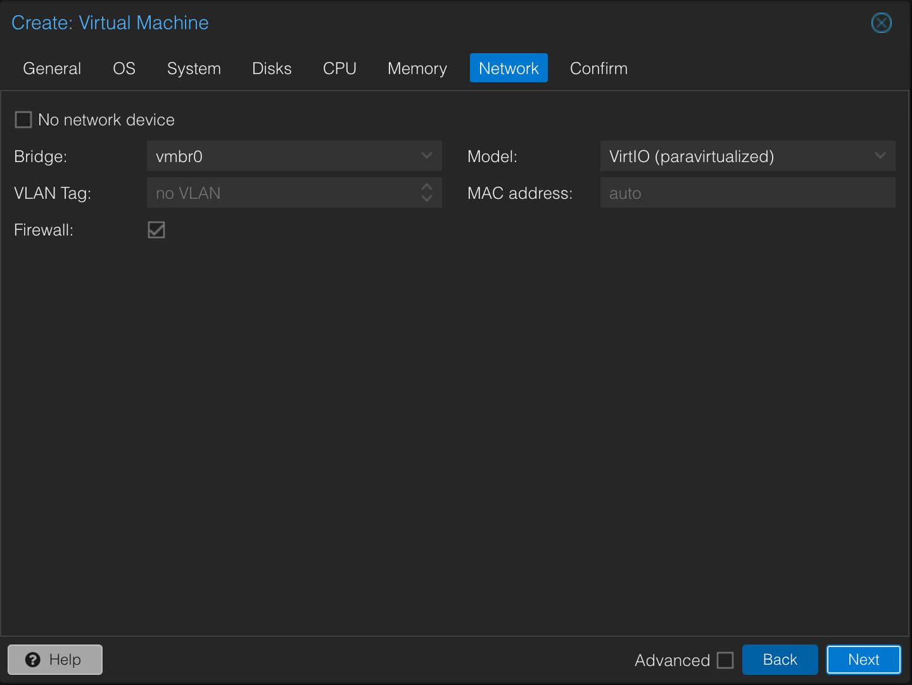
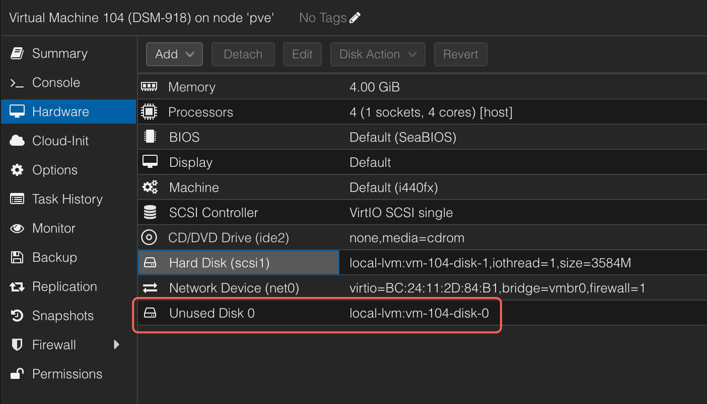
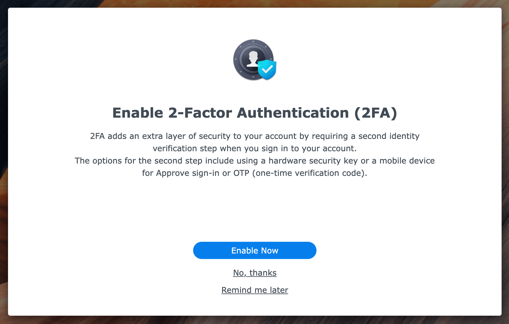

> [!caution]
> 本文仅作学习交流使用，请勿做商业用途。

群晖系统，在 NAS 行业内，算是比较成功的典范。但正版群晖系统与硬件强绑定，一些低配的硬件却能卖三四千，网友称，买软件送硬件。

所以才有了各路大神整理的 `黑群晖` 方案。即用自己 DIY 的硬件，安装正版的群晖系统。关键是 **免费** 哟。

<!-- more -->

## 引导程序

引导程序目的是让主板通电后，能够进入群晖系统。 这是所有寨板闭源系统必须攻破的大门，如 黑苹果。在此 推荐 https://github.com/RROrg/rr ， 这是目前最易用，受到广大网友认可的引导程序。

下载地址见 https://github.com/RROrg/rr/releases ，目前最新版本 25.1.0 ，此处需要下载 img 文件。

## 准备工作

- 下载引导程序并上传到 pve
- 下载群晖系统，可选。默认下载 `DS918+`, 支持 4 盘位。
    - 国内 [下载地址](https://www.synology.cn/en-global/support/download/DS918+?version=7.2#system)
    - 国外 [下载地址](https://www.synology.com/en-global/support/download/DS918+?version=7.2#system)

## 创建虚拟机

### 基本信息

- Node: 默认
- VM ID: 建议大于等于 100 任意数字，要求唯一，不重复。
- Name: 虚拟机名字


### 系统

- 不需要选择任何 iso ， 后面将直接使用引导程序 img 文件。



### 主板

- 全部默认



### 硬盘

- 添加好系统盘，不需要太大，32G 刚好。建议同时加上直通的硬盘或虚拟盘，做存储池。


### CPU

- 4核



### 内存

- 4G


### 网络

- 添加虚拟网卡



### 确认信息

- 最后检查配置结果


### 添加引导程序

```shell
qm importdisk 104 <引导程序 img> local-lvm
```



成功执行上面命令后，在虚拟机的硬件配置界面看到未使用的磁盘，双击添加磁盘。


## 安装虚拟机

- 找到目标虚拟机，右键，启动。


### 配置引导程序

- 正确进入系统后，执行 `./menu.sh` 命令，打开配置菜单。


#### 选择系统型号


- 推荐 DS918+


具体怎么选，参考 


- 选择系统版本，需要联网


- 目前最新版本 7.2


- 选择最新的小版本号


- 默认确认


#### 安装插件


- 如图是插件列表，标记部分建议安装。


#### 构建引导程序


- 需要联网下载程序。


#### 启动引导程序


### 安装系统


- 成功启动后，浏览器中输入图中地址，进入安装页面。


- 可选择在线下载系统，或上传已下载的 pat 文件。


- 弹框提示，会删除硬盘上的数据。


- 输入系统型号，通过认证


- 执行安装步骤，等待中。


- 看到图示页面，表示系统安装成功。


### 配置系统

- 添加用户名和密码


- 一定不要自动更新系统


- 跳过创建群晖账户，后续可自行添加。


- 允许群晖采集数据， 此处随意。


- 提示，安装群晖套件，可先跳过。


- 提示启用双重认证，保护账户，不要勾选。




- 最后提示创建存储池。


## 洗白

如果可通过各种渠道找到对应的序列号和 Mac 地址，可添加到配置中，洗白系统。

- 在开机界面，选择引导程序，进入命令菜单。


- 而后按照命令提示，输入 SN 和 Mac


为了更好的通过验证，建议使用外网群晖站点。
