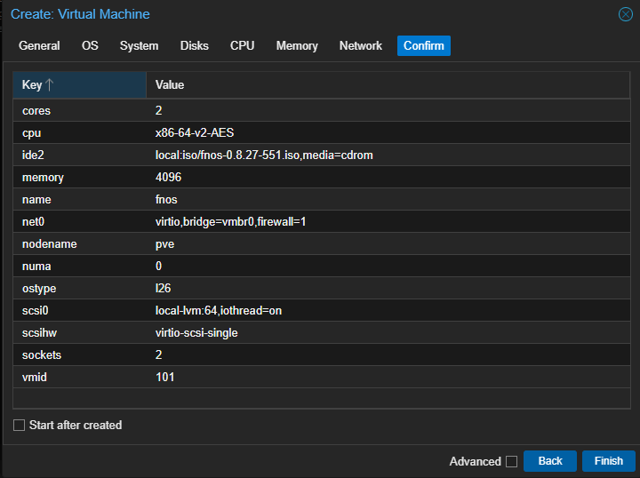

## 准备工作

下载地址：[最新版本](https://www.fnnas.com/download)

- Local 分区中找到 ISO Images ，可看到已上传的文件列表，以及上传按钮。

## 创建虚拟机

### 基本信息

- Node: 默认
- VM ID: 建议大于等于 100 任意数字，要求唯一，不重复。
- Name: 虚拟机名字

### 系统

- ISO image 处选择之前上传的 iso 文件。

### 主板

- 一切默认

### 硬盘

- 飞牛 OS 最低要求 64G 硬盘空间。 
- ==之后可以多添加几块硬盘，模拟 RAID 阵列==

### CPU

- 建议 2 核，每核 2 线程，共 4 线程

### 内存

- 最要求 4G

### 网络

- 添加一块虚拟网卡

### 确认信息

- 最后检查配置结果

### 修改启动顺序

- 修改启动项和顺序，删除网卡选项。

## 安装系统

- 启动虚拟机后，见到图示页面，说明引导成功。

- 检测到硬盘。

- 点击下一步，默认创建分区。

- 开始安装系统。

- 系统安装完成。

- 检测到网卡后，自动获取到 ip 地址

- 重启后，可在浏览器中访问

## 配置系统

### 首次登录

- 打开浏览器，输入屏幕中的地址

- 第一次登录，需要配置信息，包括管理员和密码

- 提示创建存储空间，由于之前没有添加额外硬盘，先忽略

### 创建存储空间

- 添加两块 100G 硬盘

- 最后如图，再次启动虚拟机

- 系统设置，存储空间管理界面，能看到两块硬盘， 选择 raid1 模式。

- 配置好其他信息后，输入管理员密码，开始格式化。

- 最后结果如图

