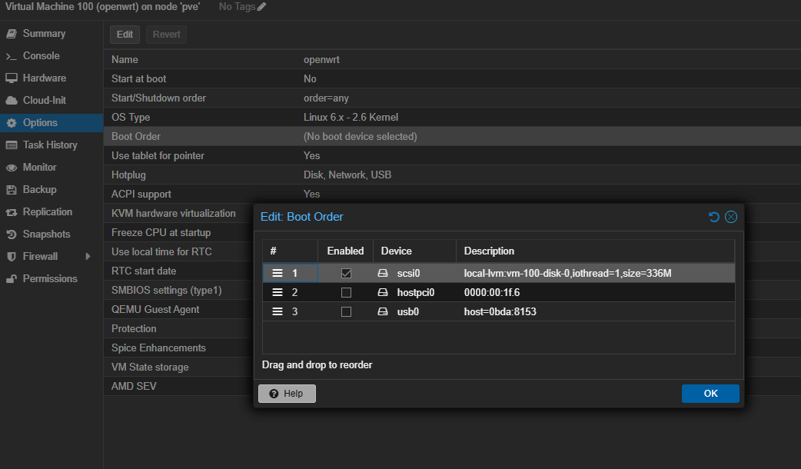
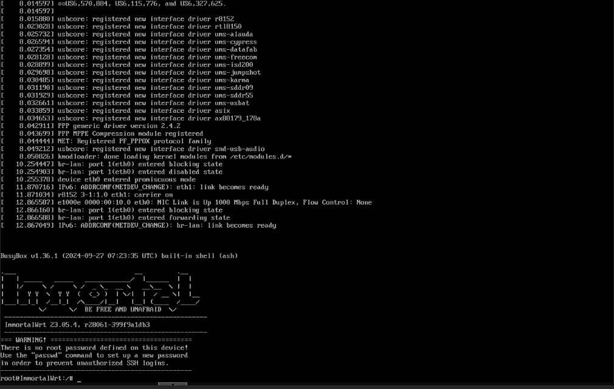

## 准备工作

### 下载文件

- 从 [官网](https://openwrt.org/downloads) 下载比较纯净的系统文件，不到 200 MB。为加快下载速度，可选国内镜像站点。


只有基本的旁路由功能。需要单独安装一些插件，如 VPN 。

- [GitHub](https://github.com/haiibo/OpenWrt) 上也有大佬提供了功能更全的安装文件。

    - 固件每天定时自动编译，以确保获得最新体验
    - 集成部分常用有线、无线、3G / 4G 网卡驱动
    - 集成中文版 netdata 实时监控插件，小白也能轻松看懂系统概况
    - 集成 iStore 应用商店，可根据自己需求自由安装所需插件
    - 集成 Docker 服务，可在 OpenWrt 内自由部署 Docker 应用
    - 集成应用过滤插件，支持游戏、视频、聊天、下载等 APP 过滤
    - 集成在线用户插件，可查看所有在线用户 IP 地址与实时速率等
    - ARMv8 系列固件内置晶晨宝盒，支持在线更新固件及内核等

| 平台+设备名称 | 固件编译状态 | 配置文件 | 固件下载 |
| :-------------: | :-------------: | :-------------: | :-------------: |
| [](https://github.com/haiibo/OpenWrt/blob/main/.github/workflows/X86_64-OpenWrt.yml) | [](https://github.com/haiibo/OpenWrt/actions/workflows/X86_64-OpenWrt.yml) | [](https://github.com/haiibo/OpenWrt/blob/main/configs/x86_64.config) | [](https://github.com/haiibo/OpenWrt/releases/tag/X86_64) |
| [](https://github.com/haiibo/OpenWrt/blob/main/.github/workflows/ARMv8-Mini-OpenWrt.yml) | [](https://github.com/haiibo/OpenWrt/actions/workflows/ARMv8-Mini-OpenWrt.yml) | [](https://github.com/haiibo/OpenWrt/blob/main/configs/armv8-mini.config) | [](https://github.com/haiibo/OpenWrt/releases/tag/ARMv8_MINI) |
| [](https://github.com/haiibo/OpenWrt/blob/main/.github/workflows/ARMv8-Plus-OpenWrt.yml) | [](https://github.com/haiibo/OpenWrt/actions/workflows/ARMv8-Plus-OpenWrt.yml) | [](https://github.com/haiibo/OpenWrt/blob/main/configs/armv8-plus.config) | [](https://github.com/haiibo/OpenWrt/releases/tag/ARMv8_PLUS) |
| [](https://github.com/haiibo/OpenWrt/blob/main/.github/workflows/Rockchip-OpenWrt.yml) | [](https://github.com/haiibo/OpenWrt/actions/workflows/Rockchip-OpenWrt.yml) | [](https://github.com/haiibo/OpenWrt/blob/main/configs/rockchip.config) | [](https://github.com/haiibo/OpenWrt/releases/tag/Rockchip) |
| [](https://github.com/haiibo/OpenWrt/blob/main/.github/workflows/RaspberryPi4-OpenWrt.yml) | [](https://github.com/haiibo/OpenWrt/actions/workflows/RaspberryPi4-OpenWrt.yml) | [](https://github.com/haiibo/OpenWrt/blob/main/configs/rpi4.config) | [](https://github.com/haiibo/OpenWrt/releases/tag/RaspberryPi4) |
| [](https://github.com/haiibo/OpenWrt/blob/main/.github/workflows/RaspberryPi3-OpenWrt.yml) | [](https://github.com/haiibo/OpenWrt/actions/workflows/RaspberryPi3-OpenWrt.yml) | [](https://github.com/haiibo/OpenWrt/blob/main/configs/rpi3.config) | [](https://github.com/haiibo/OpenWrt/releases/tag/RaspberryPi3) |

选择对应平台的文件下载即可。

- [immortalwrt](https://github.com/immortalwrt/immortalwrt) 是基于 OpenWrt 专为国人开发的，汉化做的很好，也有丰富的软件库。[固件选择器](https://firmware-selector.immortalwrt.org/) 可找到适配你手中设备的系统。如 `x86` `xiaomi` `huawei`。

### 上传文件

- Local 分区中找到 ISO Images ，可看到已上传的文件列表，以及上传按钮。


- 上传成功后，==复制保留上传后的地址，后面有用== 。


## 创建虚拟机

### 基本信息

- Node: 默认
- VM ID: 建议大于等于 100 任意数字，要求唯一，不重复。==这个 ID 在后面有用== 。
- Name: 虚拟机名字


### 系统

- 不用选择任何安装镜像，因为直接基于之前上传的 img 文件安装。


### 主板

- 一切选择默认


### 硬盘

- 删除硬盘，不需要


### CPU

- 只需要 2 核就够了


### 内存

- 最低 2G，4G 更佳


### 网络

- 不需要虚拟网卡，直接选择 PCI 或 USB 网卡


### 确认信息

- 最终信息比较简洁，只设置了 CPU 和内存，ide2 是光驱位，稍后也将删除


## 配置虚拟机

### 删除光驱


### 导入 img

-  将 img 文件转成磁盘。100 是虚拟机 id，local-lvm 存储磁盘文件的分区

```shell
qm importdisk 100  /var/lib/vz/template/iso/immortalwrt-23.05.4-x86-64-generic-squashfs-combined-efi.img local-lvm
```

- 成功转换 img 文件后，如图所示


- 选中后编辑，添加硬盘


### 添加网卡

> [!tip]
> 关于网卡，建议按需添加。如果是在 PVE 里运行 OpenWrt，但是电脑只有一个网卡，那只能添加虚拟网卡。如果继续使用 PCI 网卡，将会导致和 PVE 系统的网卡冲突。

我在这里添加两个网卡是将其一端接入光猫，另外一端接入路由器，然后将两个网口桥接。如果光猫端口多，请随意。

- PCI 网卡

==需要开启 PCI 直通==


- USB 网卡


### 修改启动顺序

- 选中硬盘，并移动到最前



### 检查配置

- 最终配置如下


## 启动虚拟机


- 如图示，openwrt 启动成功


- 在如下界面修改网卡 IP 地址和密码



### 修改 IP

默认 IP 地址 192.168.1.1 ，可能和光猫，路由器等网关地址冲突。

需要通过 `vi /etc/config/network` 命令修改，完成后重启。

### 登录 OpenWrt

在浏览器中输入修改后的 IP 地址，打开网页如图。 默认密码 `password` 。


### 修改密码

登录后，看到醒目的标识提醒修改密码，按提示操作。


