## 创建虚拟机

### 基本信息

- Node: 默认
- VM ID: 建议大于等于 100 任意数字，要求唯一，不重复。
- Name: 虚拟机名字

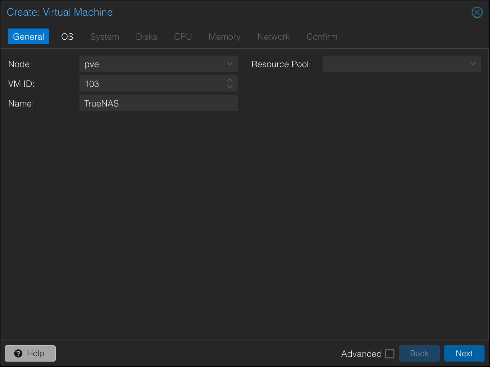

### 系统

- 选择下载下来的 iso 文件

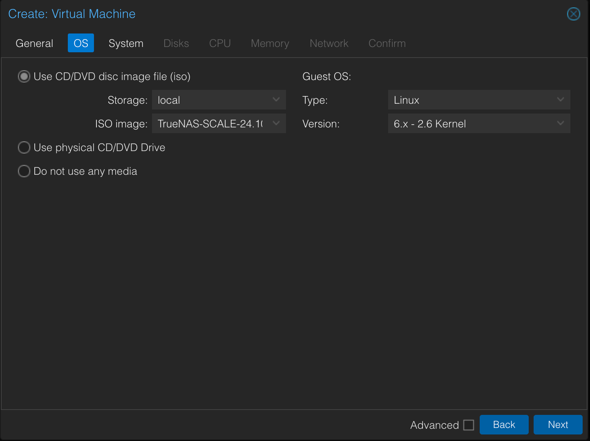

### 主板

- 默认配置

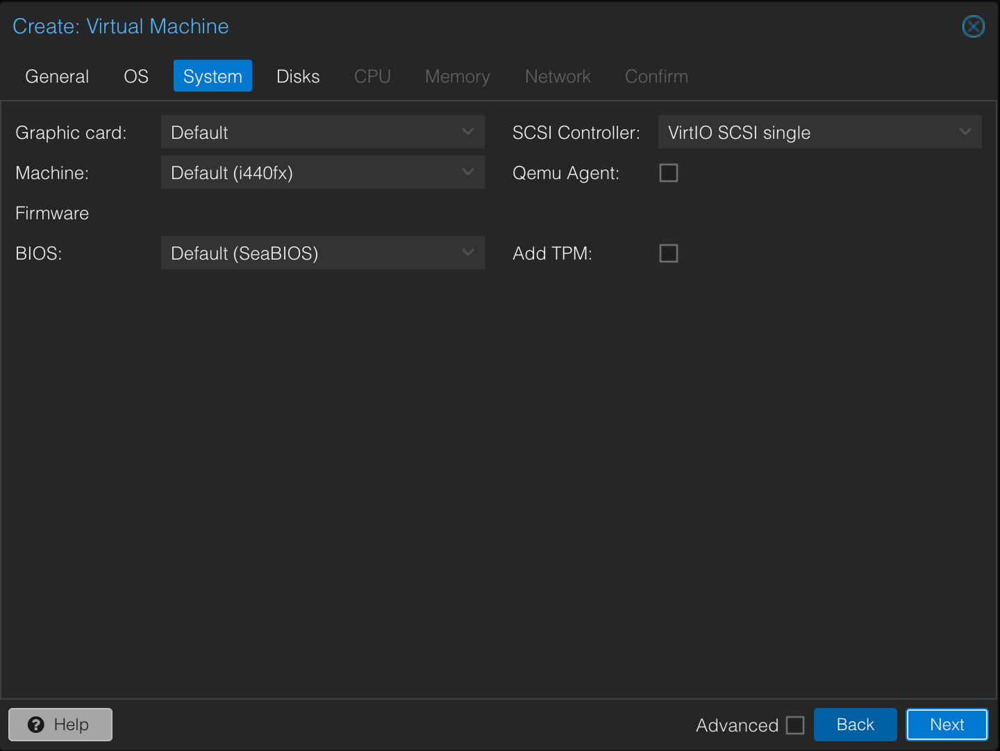

### 硬盘

- 系统盘 16G 刚好。
- 数据盘按照需求，或直接使用直通硬盘。

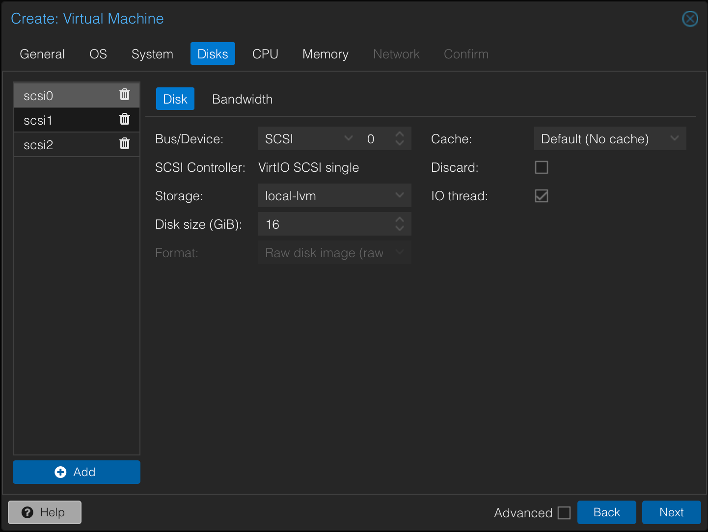

### CPU

- 双核

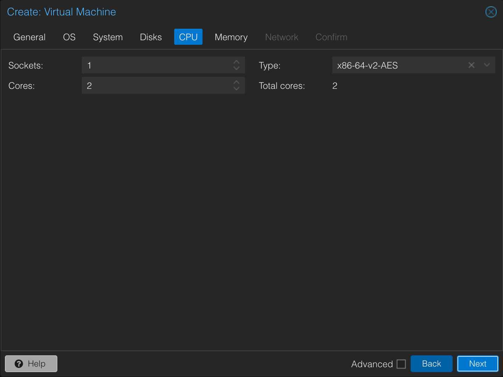

### 内存

- 8G

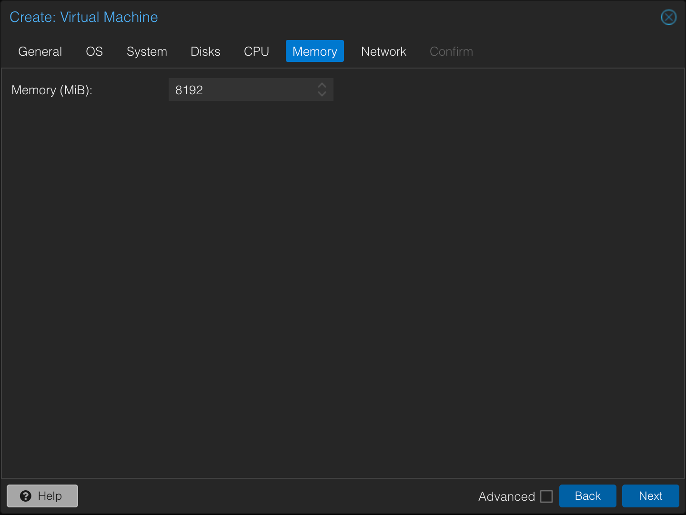

### 网络

- 添加虚拟网卡。

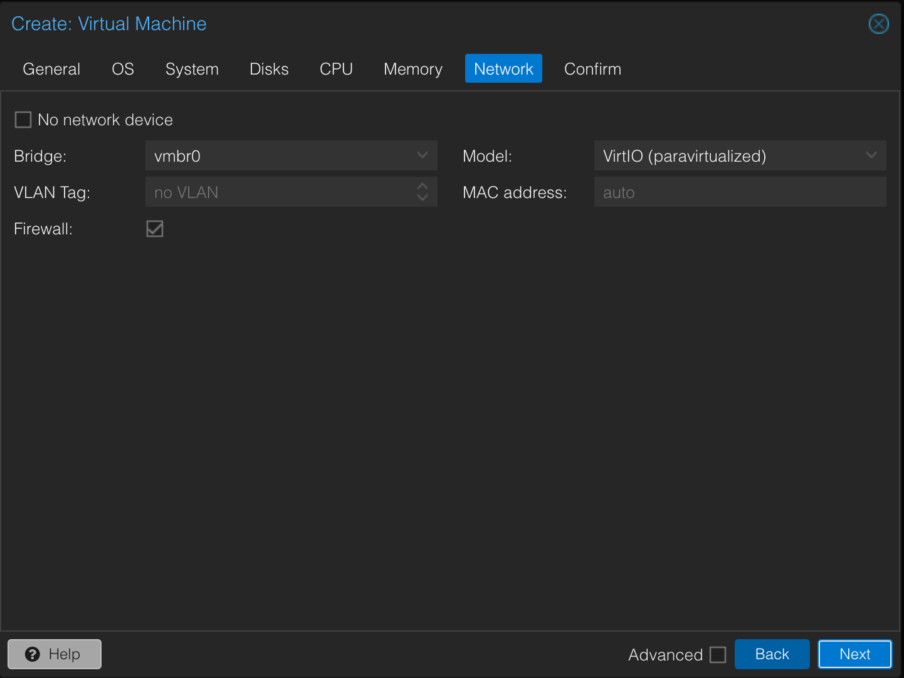

### 确认信息

- 最后检查配置结果

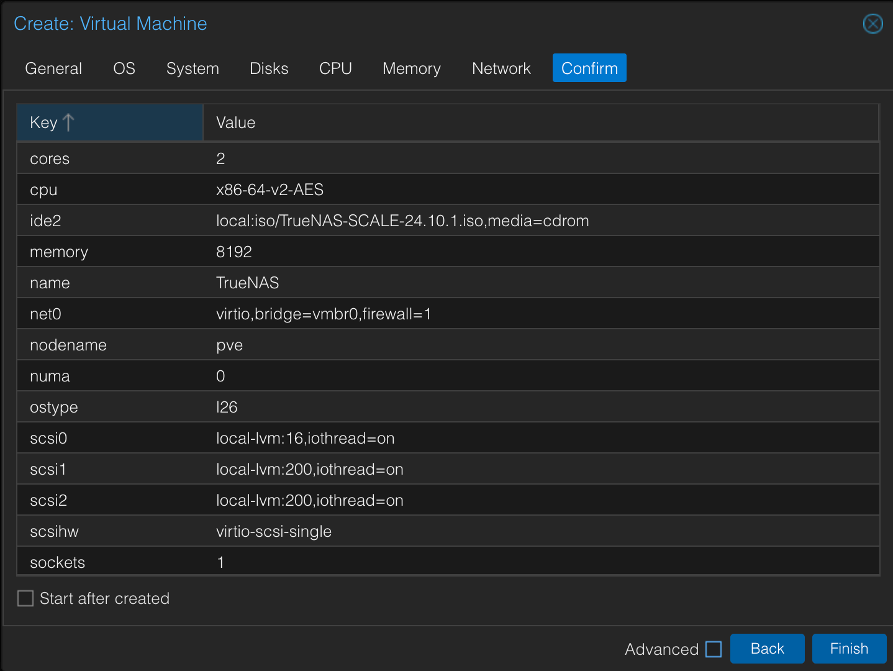

### 修改引导顺序

- 将系统盘设置在最前面。

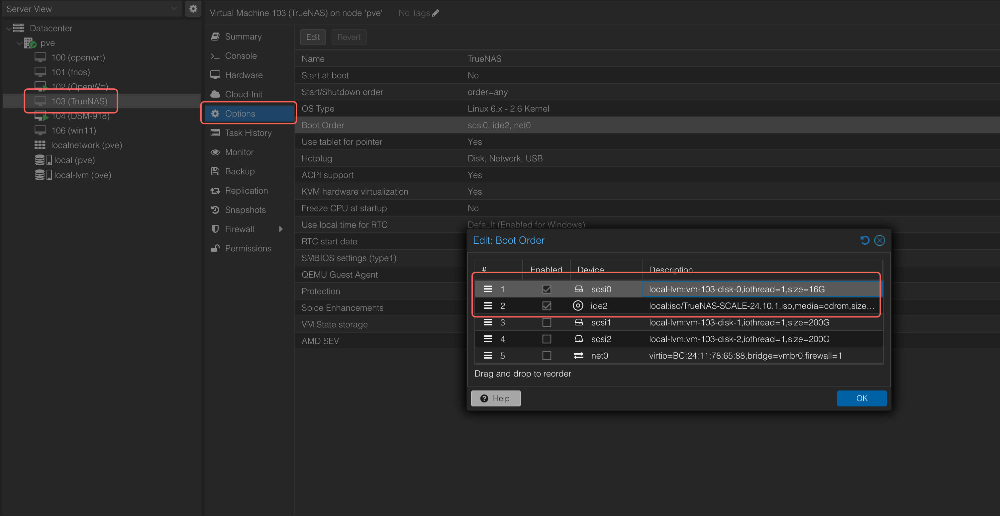

## 安装虚拟机

找到目标虚拟机，右键，启动。

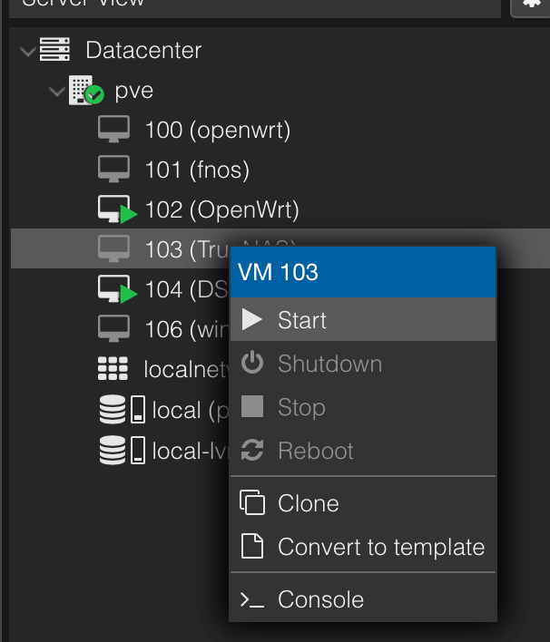

- 正确进入引导页。

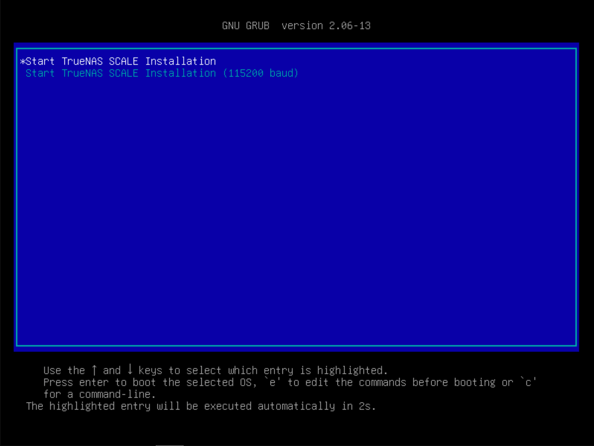

- 选择 1 安装系统。

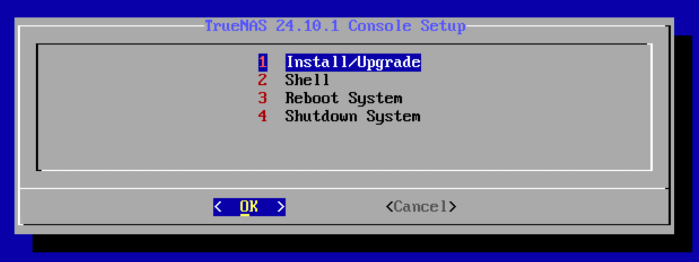

- 通过空格键选择需要安装的系统盘。

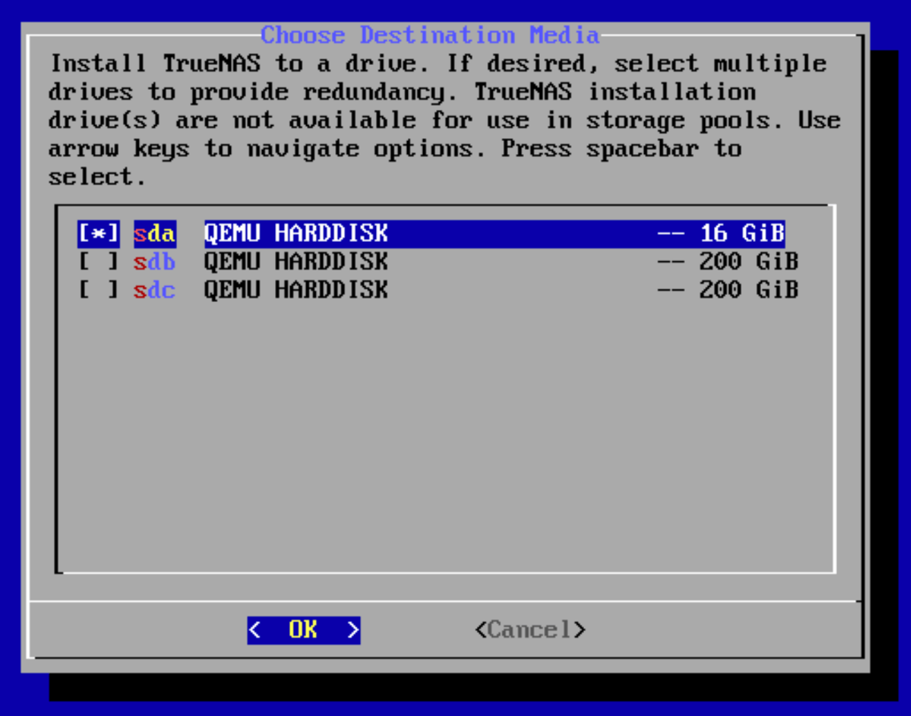

- 点击回车确认。

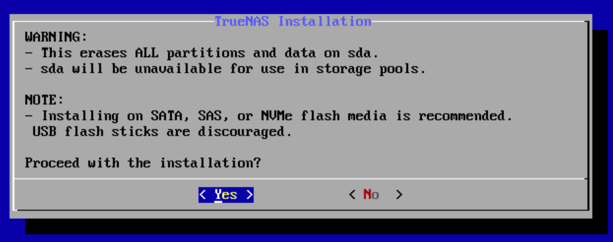

- 选择 2 ，通过 web 页面添加账户。

- 选择 EFI 启动

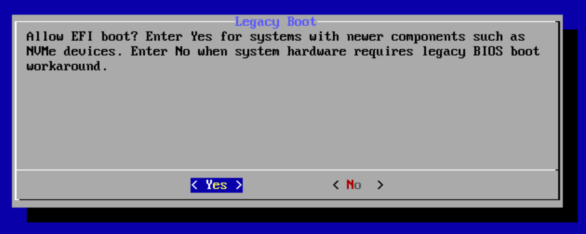

- 安装成功。

- 重启系统。

- 直到图示页面，在浏览器中输入地址，进入系统。

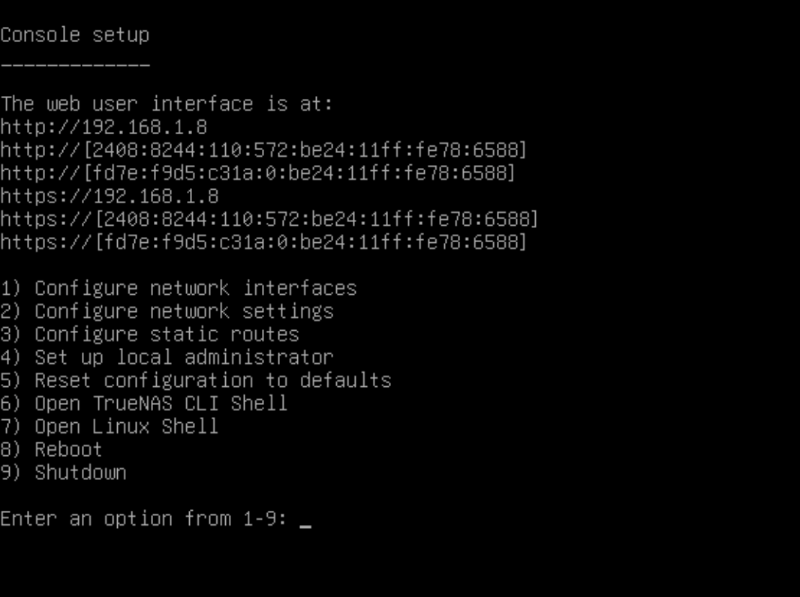