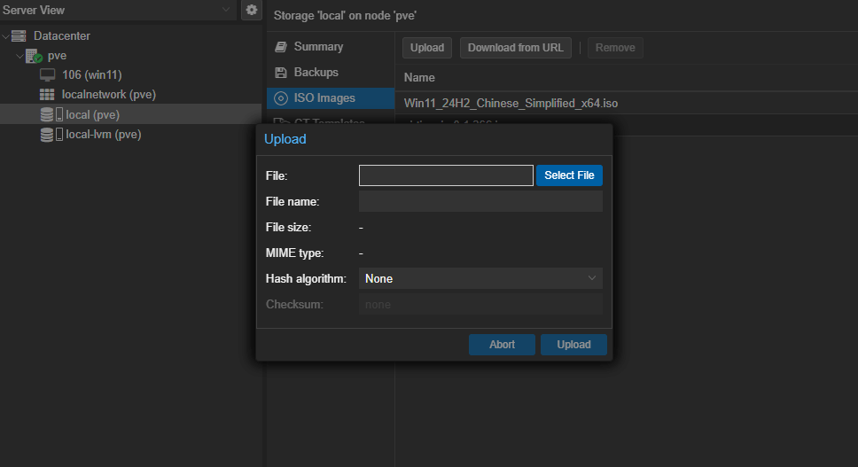
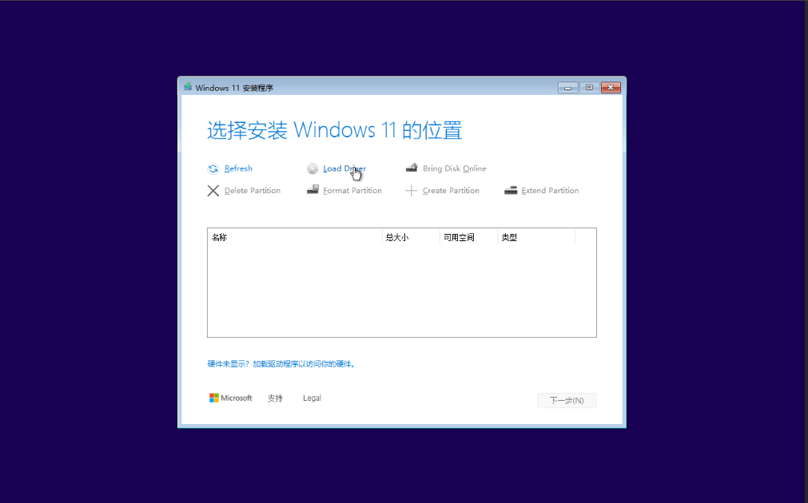
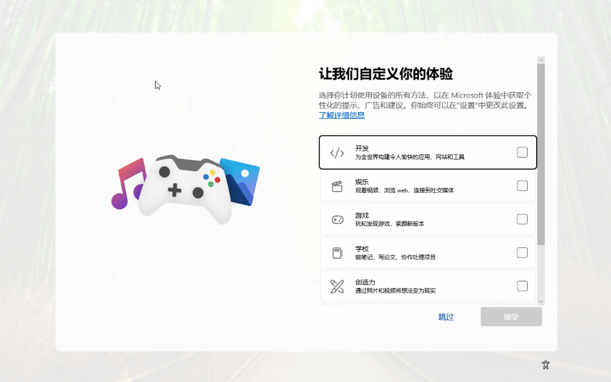

## 准备工作

官方文档 [Windows VirtIO Drivers](https://pve.proxmox.com/wiki/Windows_VirtIO_Drivers) 提供了最新的 虚拟 IO 驱动镜像 [下载地址](https://fedorapeople.org/groups/virt/virtio-win/direct-downloads/stable-virtio/virtio-win.iso)。

Windows 资源下载站点：
- https://msdn.itellyou.cn/ 可以下载 win10 及其以前的系统版本
- https://next.itellyou.cn/ 可以下载 win11 及其以后的系统版本，包括 Linux 等

同时，也建议从官方站点下载。

### 上传文件

- Local 分区中找到 ISO Images ，可看到已上传的文件列表，以及上传按钮。


- 选择本地磁盘上的文件，上传到 PVE 。 




## 创建虚拟机

### 基本信息

- Node: 默认
- VM ID: 大于 100 任意数字，要求唯一，不重复。
- Name: 虚拟机名字


### 系统

- 选择之前上传的 windows 11 镜像文件到 CD/DVD 驱动器。
- 操作系统版本选择 windows 及其对应的版本
- 添加增强驱动文件 VirtIO，刚刚上传过


### 主板

- 图形卡 默认
- 机器 q35
- SCSI 控制器 默认 VirtIO SCSI single
- Qemu Agent 勾选
- BIOS OVMF
- 添加 EFI 磁盘，并选择存储位置
- 添加 TPM ([受信任的平台模块](https://support.microsoft.com/zh-cn/topic/%E4%BB%80%E4%B9%88%E6%98%AF-tpm-705f241d-025d-4470-80c5-4feeb24fa1ee))，并选择存储位置和默认版本


### 硬盘

- 设备总线 SCSI
- SCSI 控制器 ，主板上选个
- 选择存储位置，大小合适，推荐 100G。主要用于安装系统， 存储数据可通过新增磁盘或使用物理硬盘直通功能
- 缓存 默认
- IO 线程勾选
- 如果是固态硬盘，勾选 SSD


### CPU

- 一块 CPU Sockets 默认 1
- 按照 CPU 实际核心数设置，太大可能会导致 PVE 卡死


### 内存

- 按照实际物理内存分配， 不建议低于 8G 


### 网络


### 确认信息

- 最后确认之前配置的信息


- 同时也可以在 PVE 控制页面查看


## 安装 OS

- 在启动顺序中，移除第四个网络串口


- 选中 Console Tab， 点击启动虚拟机


- 顺利进入安装页面


- 找不见磁盘，需要安装 VirtIO 驱动




- 以上步骤执行完成后，进入安装流程


## 配置 OS


- 连不上网络，也需要安装 VirtIO 驱动





## 激活系统


### 方法一(已验证)

```cmd
slmgr /ipk W269N-WFGWX-YVC9B-4J6C9-T83GX # 专业版，已验证
# 激活服务器，要与 key 对应
slmgr /skms kms.03k.org

slmgr /ipk YTMG3-N6DKC-DKB77-7M9GH-8HVX7 # 家庭版，未验证
slmgr /ipk 3KHY7-WNT83-DGQKR-F7HPR-844BM # 企业版，未验证
slmgr /ipk VK7JG-NPHTM-C97JM-9MPGT-3V66T # 专业版，未验证
slmgr /skms yy.us.to

slmgr /ato
```


kms 服务地址：kms.0t.net.cn

### 方法二(未验证)

https://massgrave.dev/

## 显卡直通

## 硬盘直通
