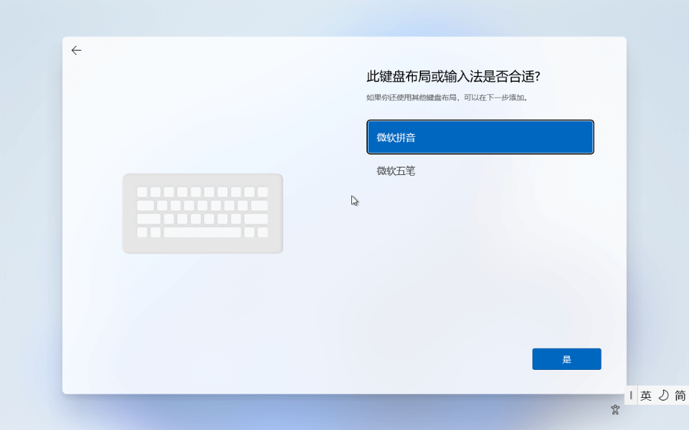
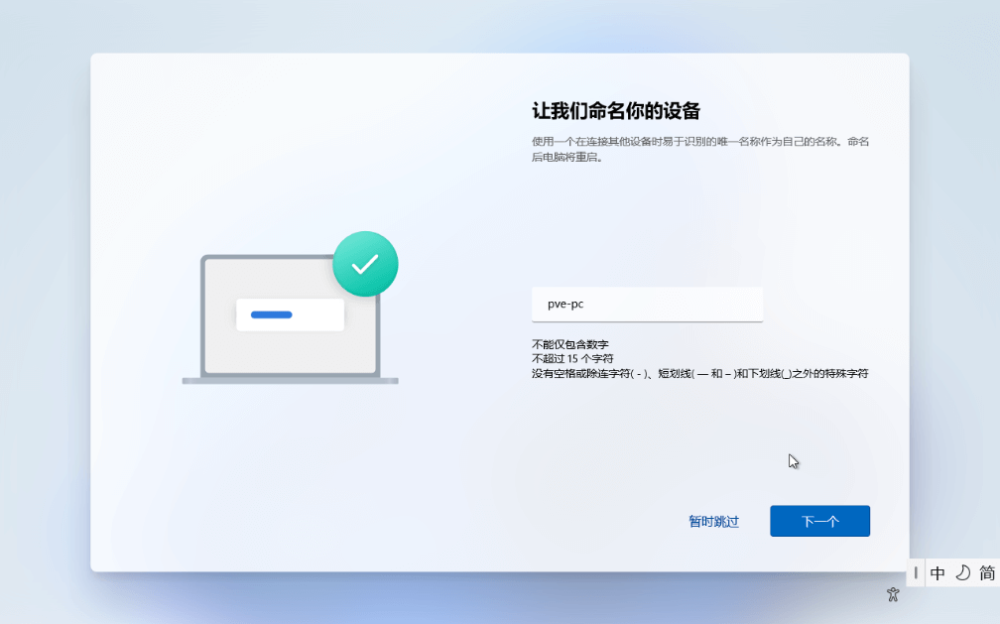
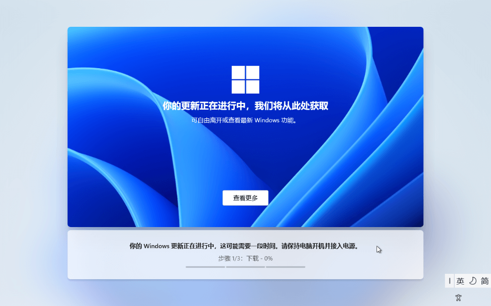

## 准备工作

官方文档 [Windows VirtIO Drivers](https://pve.proxmox.com/wiki/Windows_VirtIO_Drivers) 提供了最新的 虚拟 IO 驱动镜像 [下载地址](https://fedorapeople.org/groups/virt/virtio-win/direct-downloads/stable-virtio/virtio-win.iso)。

Windows 资源下载站点：
- https://msdn.itellyou.cn/ 可以下载 win10 及其以前的系统版本
- https://next.itellyou.cn/ 可以下载 win11 及其以后的系统版本，包括 Linux 等

同时，也建议从官方站点下载。

## 创建虚拟机

### 基本信息

### 系统

### 主板

### 硬盘

### CPU

### 内存

### 网络

### 确认信息

## 安装 OS

## 配置 OS

