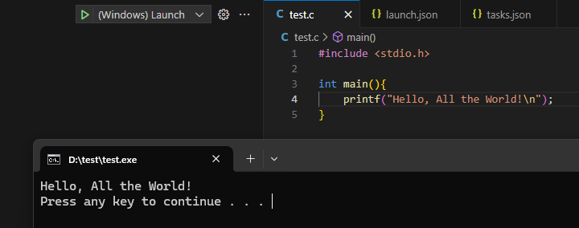
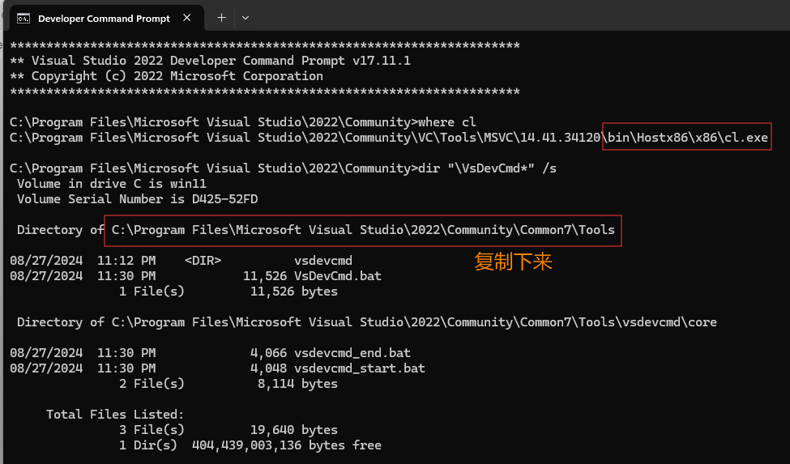

## 编译器

### Windows

如已安装 `Visual Studio`，可直接使用 `MSVC` 。亦可以单独下载第三方编译器 MinGW [下载地址](https://github.com/niXman/mingw-builds-binaries/releases)。

参考文档 [MinGW](https://code.visualstudio.com/docs/cpp/config-mingw), [MSVC](https://code.visualstudio.com/docs/cpp/config-msvc)。

MinGW 版本说明：
- i686 32 位系统用 ，x86_64 64位系统用。
- win32 windows 系统用
- msvcrt 微软c++ 运行环境 ，ucrt 通用c++运行环境


> 所以，做跨平台开发建议下载 [x86_64-14.2.0-release-win32-seh-ucrt-rt_v12-rev0.7z](https://github.com/niXman/mingw-builds-binaries/releases/download/14.2.0-rt_v12-rev0/x86_64-14.2.0-release-win32-seh-ucrt-rt_v12-rev0.7z)，解压后，将目录添加到环境变量。

打开终端，检测如图所示表示成功。


### Mac

Mac 有提供专用的的 clang 编译。使用 `clang --version` 检查如下：

```
Apple clang version 16.0.0 (clang-1600.0.26.4)
Target: arm64-apple-darwin23.6.0
Thread model: posix
InstalledDir: /Applications/Xcode.app/Contents/Developer/Toolchains/XcodeDefault.xctoolchain/usr/bin
```

一般通过 `XCode` 安装，如不需安装 `XCode` ， 可用 `xcode-select --install` 单独安装 clang.

参考文档 [Mac Clang](https://code.visualstudio.com/docs/cpp/config-clang-mac)。

### Linux

Linx 上 可通过包管理器，安装需要的编译器。以 Ubuntu 为例：

```shell
apt install gcc g++ # 安装 gcc g++
apt install clang # 安装 clang
```

参考文档 [Linux GCC](https://code.visualstudio.com/docs/cpp/config-linux)。

## 相关插件


安装方式如图：


## 配置 VSCode

新建一个空文件夹，并用 VSCode 打开。 新建测试文件 `test.c`，代码内容如下

```C
#include <stdio.h>

int main(){
    printf("Hello, World!\n");
}
```

### 运行


:::tabs

@tab windows

选择  `Run C/C++` File后 ，选择第一个。注意看底下 gcc.exe 文件的位置。


运行后，终端中看到如下字样表示成功。

```
 *  Executing task: C/C++: g++.exe build active file 

Starting build...
cmd /c chcp 65001>nul && D:\Development\mingw64\bin\g++.exe -fdiagnostics-color=always -g D:\SourceCode\test\test.cpp -o D:\SourceCode\test\test.exe

Build finished successfully.
 *  Terminal will be reused by tasks, press any key to close it. 
 ```

> Windows 上会自动运行程序，得如下输出：


@tab Mac

选择  `Run C/C++` File后 ，选择第一个。注意看底下 clang 文件的位置。


运行后，终端中看到如下字样表示成功。

```
 *  Executing task: C/C++: clang build active file 

Starting build...
/usr/bin/clang -std=gnu++14 -fcolor-diagnostics -fansi-escape-codes -g /Users/FluekyZuo/test/test.cpp -o /Users/FluekyZuo/test/test

Build finished successfully.
 *  Terminal will be reused by tasks, press any key to close it. 
 ```

@tab Linux

选择  `Run C/C++` File后 ，选择第一个。注意看底下 gcc 文件的位置。


运行后，终端中看到如下字样表示成功。

```
 *  Executing task: C/C++: g++ build active file 

Starting build...
/usr/bin/g++ -fdiagnostics-color=always -g /home/flueky.zuo/test/test.cpp -o /home/flueky.zuo/test/test

Build finished successfully.
 *  Terminal will be reused by tasks, press any key to close it. 
 ```

:::

以上操作，只有 windows 平台可以直接运行源文件，其他平台都只执行编译操作。 如需继续执行、调试，还需添加如下配置。

### 配置 launch.json

创建一个 launch.json 文件


点击 Add Configuration


输入 c 后 选择 C/C++ 对应的 Launch 程序。


生成的 launch.json 文件如下。

:::code-tabs

@tab windows launch

```json
{
    // Use IntelliSense to learn about possible attributes.
    // Hover to view descriptions of existing attributes.
    // For more information, visit: https://go.microsoft.com/fwlink/?linkid=830387
    "version": "0.2.0",
    "configurations": [
        {
            "name": "(Windows) Launch", 
            "type": "cppvsdbg",
            "request": "launch",
            // 替换 program 文件的位置。
            "program": "${fileDirname}\\${fileBasenameNoExtension}.exe",
            "args": [],
            "stopAtEntry": false,
            "cwd": "${fileDirname}",
            "environment": [],
            "console": "externalTerminal"
        }

    ]
}
```
@tab gdb launch
```json
{
    // Use IntelliSense to learn about possible attributes.
    // Hover to view descriptions of existing attributes.
    // For more information, visit: https://go.microsoft.com/fwlink/?linkid=830387
    "version": "0.2.0",
    "configurations": [
        {
            "name": "(gdb) Launch",
            "type": "cppdbg",
            "request": "launch",
            // 替换 program 文件的位置。
            "program": "${fileDirname}\\${fileBasenameNoExtension}.exe",
            "args": [],
            "stopAtEntry": false,
            "cwd": "${fileDirname}",
            "environment": [],
            "externalConsole": false,
            "MIMode": "gdb",
            // 替换 gdb 命令位置，如在环境变量下，可直接用 gdb
            "miDebuggerPath": "gdb",
            "setupCommands": [
                {
                    "description": "Enable pretty-printing for gdb",
                    "text": "-enable-pretty-printing",
                    "ignoreFailures": true
                },
                {
                    "description": "Set Disassembly Flavor to Intel",
                    "text": "-gdb-set disassembly-flavor intel",
                    "ignoreFailures": true
                }
            ]
        }
    ]
}
```
@tab lldb launch
```json
{
    // Use IntelliSense to learn about possible attributes.
    // Hover to view descriptions of existing attributes.
    // For more information, visit: https://go.microsoft.com/fwlink/?linkid=830387
    "version": "0.2.0",
    "configurations": [
        {
            "name": "(lldb) Launch",
            "type": "cppdbg",
            "request": "launch",
            // 替换 program 文件的位置。
            "program": "${fileDirname}/${fileBasenameNoExtension}.out",
            "args": [],
            "stopAtEntry": false,
            "cwd": "${fileDirname}",
            "environment": [],
            "externalConsole": false,
            "MIMode": "lldb"
        }
    ]
}
```
:::

回到第一步的位置，能看到 (Windows) Launch，记住停留在 test.c 打开的位置。


点击后如图所示，表示程序执行了起来。


::: tip 

C/C++ 源文件，需要先编译才能运行、调试。编译器一般有 MSVC（ windows 系统专用），gcc ， clang 。 在不同系统上编译出的可执行文件，即可运行在对应系统上。如需调试程序，除 windows 系统专用调试器外，还有 gdb ，lldb 等跨平台调试器。

:::

### 关联 Task

以上步骤，需要先运行 task 再 Launch 程序。然而，可以通过一行配置可以一次完成。

```json
{
    "version": "0.2.0",
    "configurations": [
        {
            "name": "(Windows) Launch",
            "type": "cppvsdbg",
            "request": "launch",
            // task.json 生成的可执行文件位置
            "program": "${fileDirname}\\${fileBasenameNoExtension}.exe",
            "args": [],
            "stopAtEntry": false,
            "cwd": "${fileDirname}",
            "environment": [],
            "console": "externalTerminal",
            // 添加这行，并写入 tasks.json 文件中的 label
            // cl.exe build active file 或 使用下载的 gcc 编译。
            // C/C++: gcc.exe build active file
            "preLaunchTask": "cl.exe build active file"
        }
    ]
}
```

修改 C 文件后，再执行` (Windows) Launch`。


运行结果如图：



如选择 ` (gdb) Launch` 或 ` (lldb) Launch` ， 结果相似。

### 调试

在代码中，第四行左边空白处点击，会出现一个红点。表示已在此处设置了断点。


选择  Debug C/C++ File后 ，如图所示。


标记位置为断点工具栏， 从左到右依次是。
- 跳转到下一个断点。
- 跳转到下一行代码。
- 跳转到代码中的函数内部。
- 跳转到上一层函数调用的地方。
- 结束断点。

## 兼容 Visual Studio

参见[官方文档](https://code.visualstudio.com/docs/cpp/config-msvc)。

Visual Studio 已经集成了编译环境，可直接提供给 VSCode 使用。 
在 Windows 搜索栏中输入 Developer Command， 找到目标程序后，并打开。


输入 where cl 和 dir "\VsDevCmd*" /s得到关键输出信息。保留，后面要用。



在 VSCode 打开的目录下，新建文件夹 .vscode并文件一个空文件 tasks.json. 添加如下内容。

```json
{
  "version": "2.0.0",
  "windows": {
    "options": {
      "shell": {
        "executable": "cmd.exe",
        "args": [
          "/C",
          // 替换下面的地址为上面复制的地址，记得保留 VsDevCmd.bat。 如用反斜杠 \, 记得添加两个。
          "\"C:\\Program Files\\Microsoft Visual Studio\\2022\\Community\\Common7\\Tools/VsDevCmd.bat\"",,
          "&&"
        ]
      }
    }
  },
  "tasks": [
    {
      "type": "shell",
      "label": "cl.exe build active file", // 记住此名字
      "command": "cl.exe",
      "args": [
        "/Zi",
        "/EHsc",
        "/Fe:",
        "${fileDirname}\\${fileBasenameNoExtension}.exe",
        "${file}"
      ],
      "problemMatcher": ["$msCompile"],
      "group": {
        "kind": "build",
        "isDefault": true
      }
    }
  ]
}
```

顶部工具栏找到 Terminal选择 Run Task. 


选择第二个，即刚刚记住的名字 cl.exe build active file


最后在底部终端看到如图所示的输出。


此时并没有看到 Hello, World!, 是因为这个 Task 之做了编译操作，没有执行。

## 完整配置

在 `C/C++` 插件安装并启用后，同时电脑上已安装编译器、调试器，即可在 `VSCode` 中生成全部的配置文件。

- tasks.json : 运行编译任务。
- launch.json ： 执行、调试程序。

:::tabs

@tab Windows msvc

tasks.json

```json
{
    "windows": {
        "options": {
            "shell": {
                "executable": "cmd.exe",
                "args": [
                    "/C",
                    // 替换下面的地址为上面复制的地址，记得保留 VsDevCmd.bat。 如用反斜杠 \, 记得添加两个。
                    "\"C:\\Program Files\\Microsoft Visual Studio\\2022\\Community\\Common7\\Tools/VsDevCmd.bat\"",
                    "&&"
                ]
            }
        }
    },
    "tasks": [
        {
            "type": "shell",
            // 任务名字，可修改，在 launch.json 中有用
            "label": "cl.exe build active file",
            "command": "cl.exe",
            "args": [
                "/Zi",
                "/EHsc",
                "/Fe:",
                // 生成的可执行文件的位置，当前源文件目录下，相同文件名，没有后缀。
                "${fileDirname}\\${fileBasenameNoExtension}.exe",
                "${file}"
            ],
            "problemMatcher": [
                "$msCompile"
            ],
            "group": {
                "kind": "build",
                "isDefault": true
            }
        }
    ],
    "version": "2.0.0"
}
```

launch.json

```json
{
    "version": "0.2.0",
    "configurations": [
        {
            "name": "(Windows) Launch",
            "type": "cppvsdbg",
            "request": "launch",
            // 可执行文件的位置，同 tasks.json 中声明的
            "program": "${fileDirname}\\${fileBasenameNoExtension}.exe",
            "args": [],
            "stopAtEntry": false,
            "cwd": "${fileDirname}",
            "environment": [],
            "console": "internalConsole",
            // tasks.json 中声明的 task name
            "preLaunchTask": "cl.exe build active file"
        }
    ]
}
```

@tab Windows gcc/gdb

tasks.json

```json
{
    "tasks": [
        {
            "type": "cppbuild",
            // 任务名字，可修改，在 launch.json 中有用
            "label": "C/C++: g++.exe build active file",
            // g++ 程序的位置，可能会有差异
            "command": "D:\\Development\\mingw64\\bin\\g++.exe",
            "args": [
                "-fdiagnostics-color=always",
                "-g",
                "${file}",
                "-o",
                // 生成的可执行文件的位置，当前源文件目录下，相同文件名，exe 后缀。
                "${fileDirname}\\${fileBasenameNoExtension}.exe"
            ],
            "options": {
                "cwd": "${fileDirname}"
            },
            "problemMatcher": [
                "$gcc"
            ],
            "group": {
                "kind": "build",
                "isDefault": true
            },
            "detail": "Task generated by Debugger."
        }
    ],
    "version": "2.0.0"
}
```

launch.json

```json
{
    "version": "0.2.0",
    "configurations": [
        {
            "name": "(gdb) Launch",
            "type": "cppdbg",
            "request": "launch",
            // 可执行文件的位置，同 tasks.json 中声明的
            "program": "${fileDirname}\\${fileBasenameNoExtension}.exe",
            "args": [],
            "stopAtEntry": false,
            "cwd": "${fileDirname}",
            "environment": [],
            "externalConsole": false,
            "MIMode": "gdb",
            "miDebuggerPath": "D:\\Development\\mingw64\\bin\\gdb.exe",
            "setupCommands": [
                {
                    "description": "Enable pretty-printing for gdb",
                    "text": "-enable-pretty-printing",
                    "ignoreFailures": true
                },
                {
                    "description": "Set Disassembly Flavor to Intel",
                    "text": "-gdb-set disassembly-flavor intel",
                    "ignoreFailures": true
                }
            ],
            // tasks.json 中声明的 task name
            "preLaunchTask": "C/C++: g++.exe build active file"
        }
    ]
}
```

@tab Mac clang/lldb

tasks.json

```json
{
    "tasks": [
        {
            "type": "cppbuild",
            // 任务名字，可修改，在 launch.json 中有用
            "label": "C/C++: clang build active file",
            // clang 程序的位置，可能会有差异
            "command": "/usr/bin/clang",
            "args": [
                "-fcolor-diagnostics",
                "-fansi-escape-codes",
                "-g",
                "${file}",
                "-o",
                // 生成的可执行文件的位置，当前源文件目录下，相同文件名，没有后缀。
                "${fileDirname}/${fileBasenameNoExtension}"
            ],
            "options": {
                "cwd": "${fileDirname}"
            },
            "problemMatcher": [
                "$gcc"
            ],
            "group": {
                "kind": "build",
                "isDefault": true
            },
            "detail": "Task generated by Debugger."
        }
    ],
    "version": "2.0.0"
}
```

launch.json

```json
{
    "version": "0.2.0",
    "configurations": [
        {
            "name": "(lldb) Launch",
            "type": "cppdbg",
            "request": "launch",
            // 可执行文件的位置，同 tasks.json 中声明的
            "program": "${fileDirname}/${fileBasenameNoExtension}",
            "args": [],
            "stopAtEntry": false,
            "cwd": "${fileDirname}",
            "environment": [],
            "externalConsole": false,
            "MIMode": "lldb",
            // tasks.json 中声明的 task name
            "preLaunchTask": "C/C++: clang build active file"
        }
    ]
}
```

@tab Linux gcc/gdb

tasks.json

```json
{
    "tasks": [
        {
            "type": "cppbuild",
            // 任务名字，可修改，在 launch.json 中有用
            "label": "C/C++: g++ build active file",
            // g++ 程序的位置，可能会有差异
            "command": "/usr/bin/g++",
            "args": [
                "-fdiagnostics-color=always",
                "-g",
                "${file}",
                "-o",
                // 生成的可执行文件的位置，当前源文件目录下，相同文件名，没有后缀。
                "${fileDirname}/${fileBasenameNoExtension}.out"
            ],
            "options": {
                "cwd": "${fileDirname}"
            },
            "problemMatcher": [
                "$gcc"
            ],
            "group": {
                "kind": "build",
                "isDefault": true
            },
            "detail": "Task generated by Debugger."
        }
    ],
    "version": "2.0.0"
}
```

launch.json

```json
{
    "version": "0.2.0",
    "configurations": [
        {
            "name": "(gdb) Launch",
            "type": "cppdbg",
            "request": "launch",
            // 可执行文件的位置，同 tasks.json 中声明的
            "program": "${fileDirname}/${fileBasenameNoExtension}.out",
            "args": [],
            "stopAtEntry": false,
            "cwd": "${fileDirname}",
            "environment": [],
            "externalConsole": false,
            "MIMode": "gdb",
            "setupCommands": [
                {
                    "description": "Enable pretty-printing for gdb",
                    "text": "-enable-pretty-printing",
                    "ignoreFailures": true
                },
                {
                    "description": "Set Disassembly Flavor to Intel",
                    "text": "-gdb-set disassembly-flavor intel",
                    "ignoreFailures": true
                }
            ],
            // tasks.json 中声明的 task name
            "preLaunchTask": "C/C++: g++ build active file"
        }
    ]
}
```

:::