安全外壳协议（Secure Shell，简称SSH）是一种在不安全网络上用于安全远程登录和其他安全网络服务的协议（摘自百科）。

<!-- more -->

此处启用 SSH 功能，主要是开启服务端的功能，使得其他设备可通过网络访问当前主机。

## 安装程序

推荐使用 Windows 内置程序安装 SSH 服务端。支持如下两种方式找到安装界面。

在搜索工具栏中输入 `可选功能`

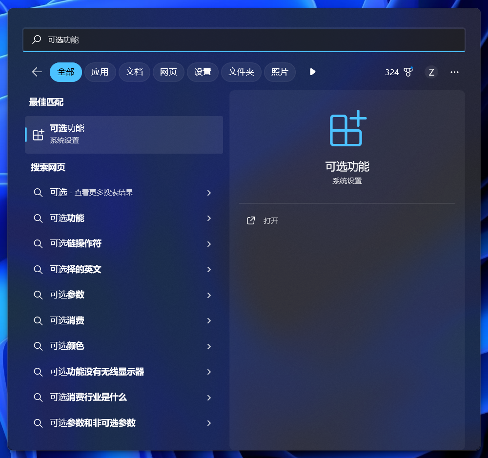

或者打开设置页面，应用栏中，找到`可选功能`，打开。

先检查，已安装的功能中，是否已经包含了 SSH 服务端程序。需要安装的话，点击右上角，添加功能，然后输入 `ssh` ， 查找程序。

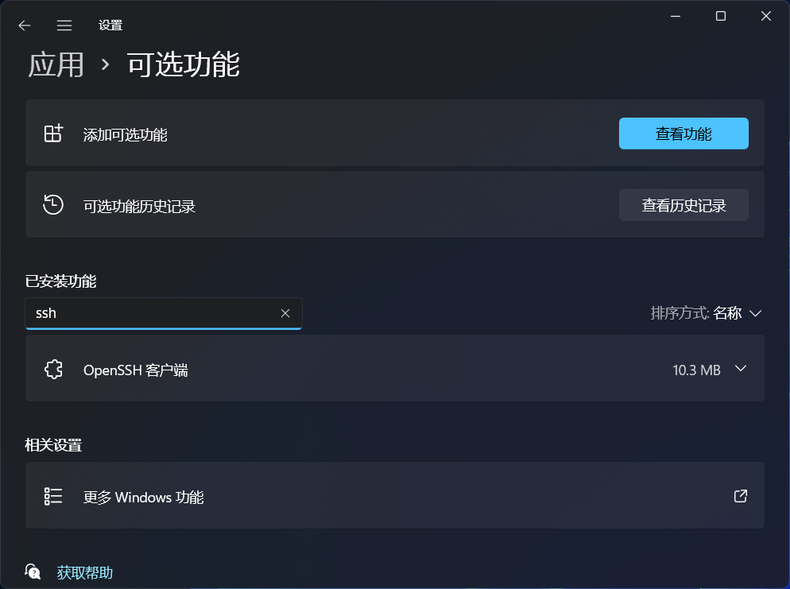

输入 `ssh` 找到 `openssh` 服务端程序。

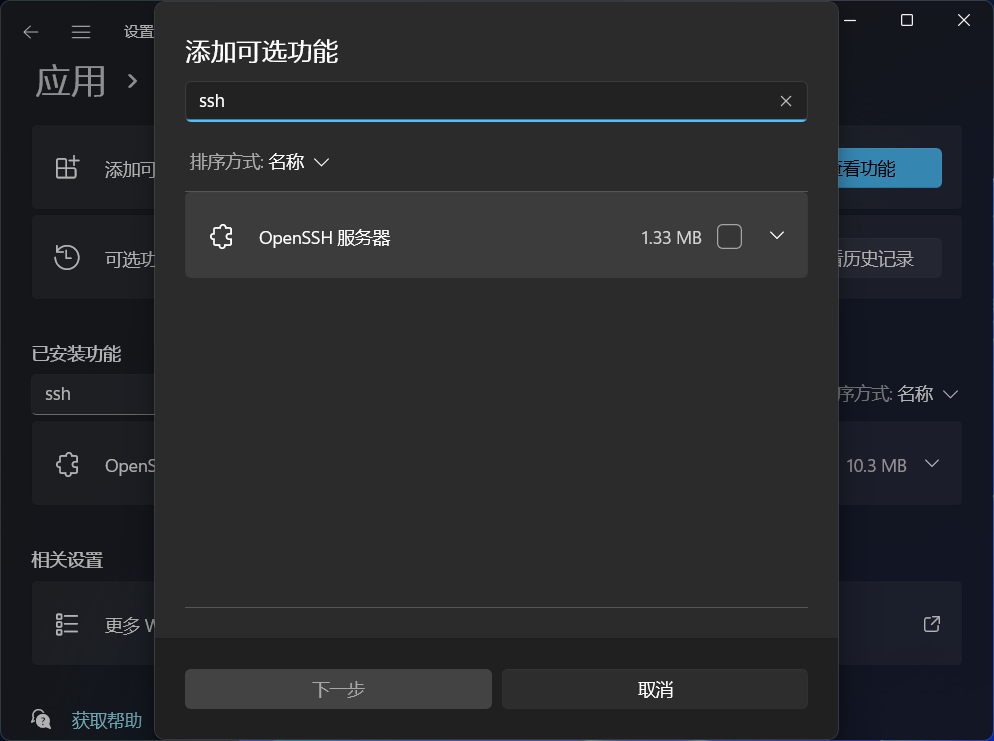

选中后安装。

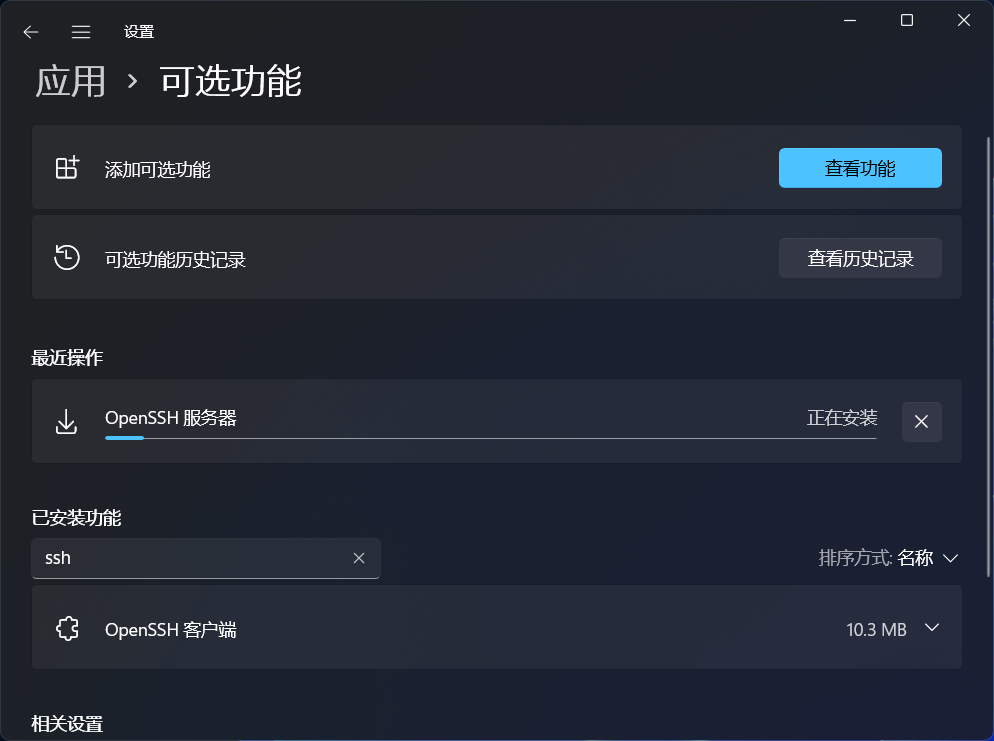

安装完成后，如图。

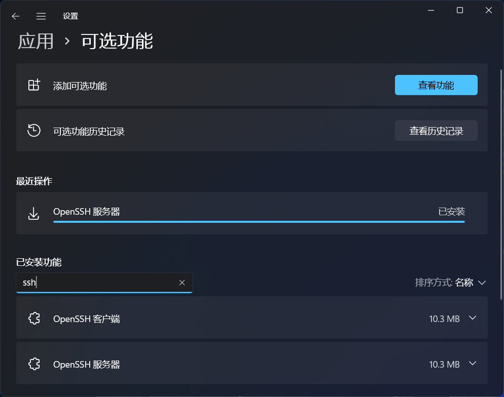

## 设置防火墙

在搜索工具栏中输入 `防火墙` 。

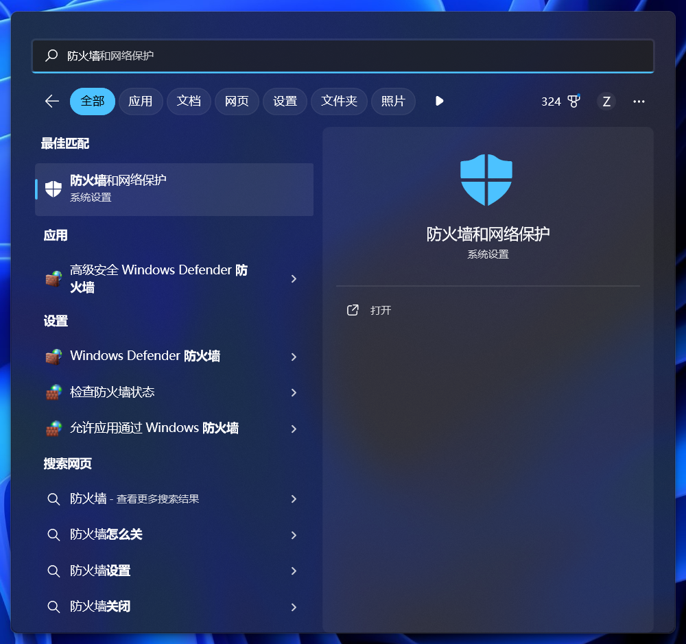

选择 `允许应用通过防火墙` 。

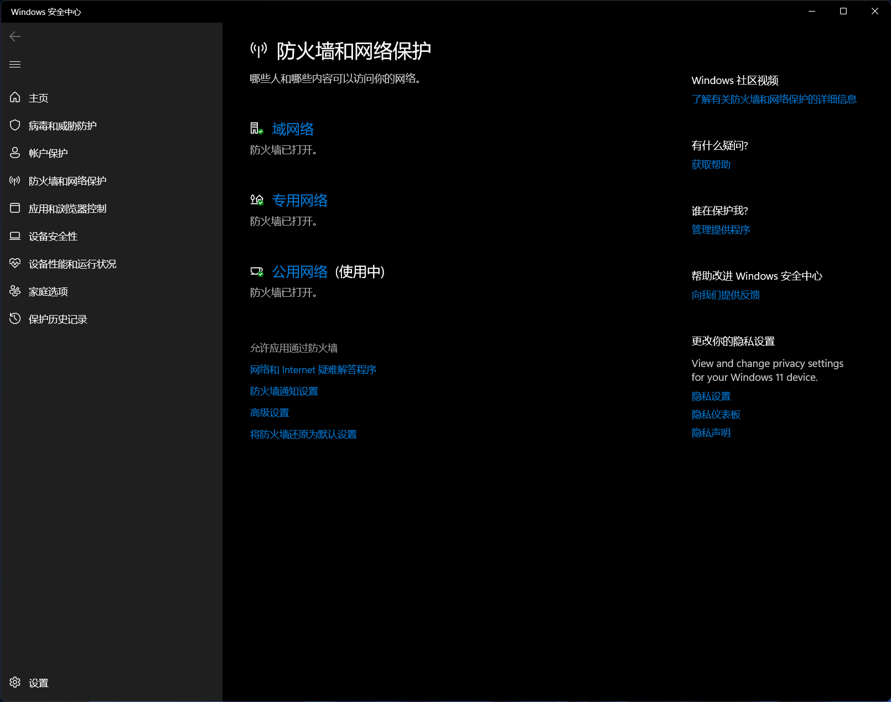

编辑设置，找到 `OpenSSH Server` 。 检查两个选项是否都勾选上。

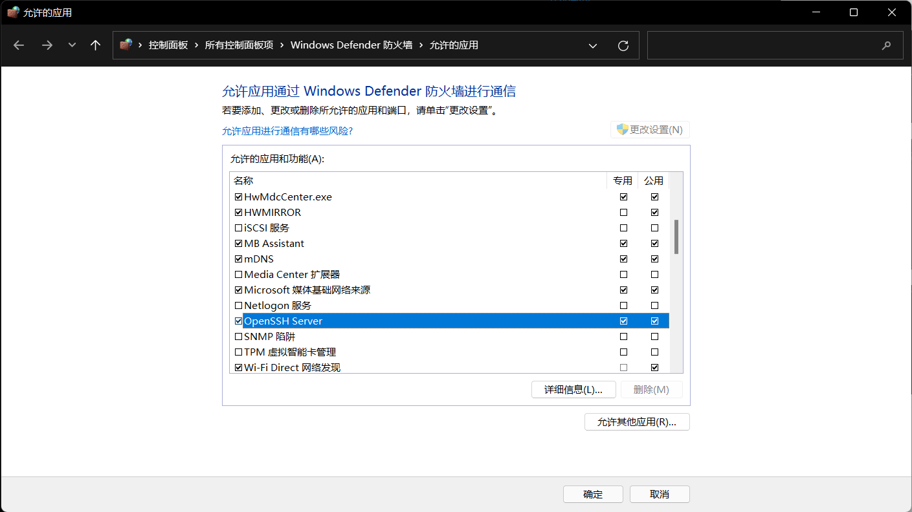

## 配置服务

在搜索工具栏中输入 `服务` 。

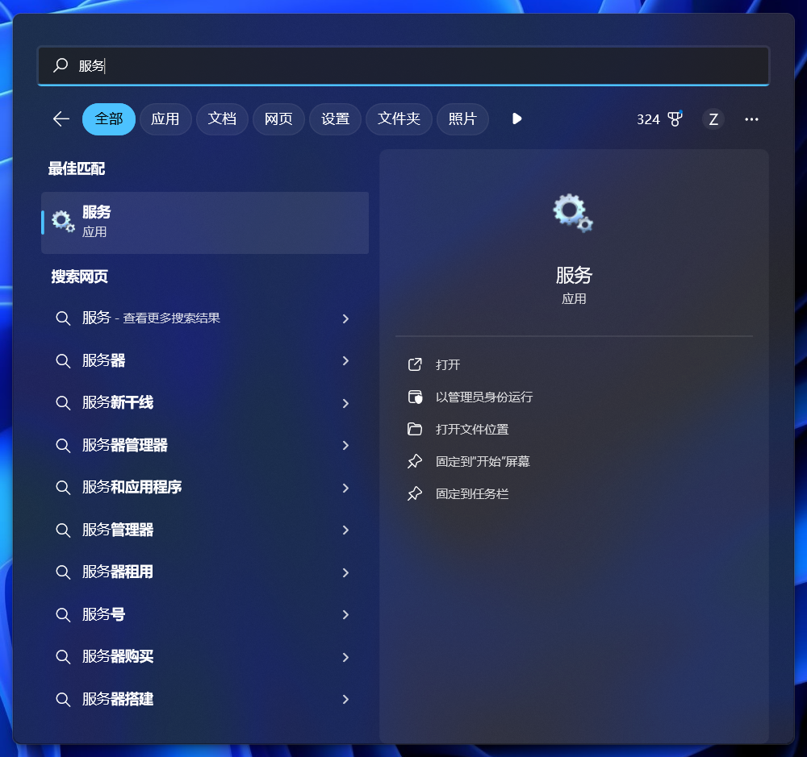

找到 `OpenSSH SSH Server` ， 右键然后选择属性。

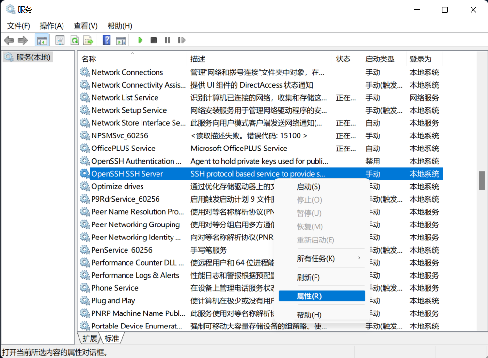

启动类型选择 `自动(延时启动)` ，同时 `启动` 服务。

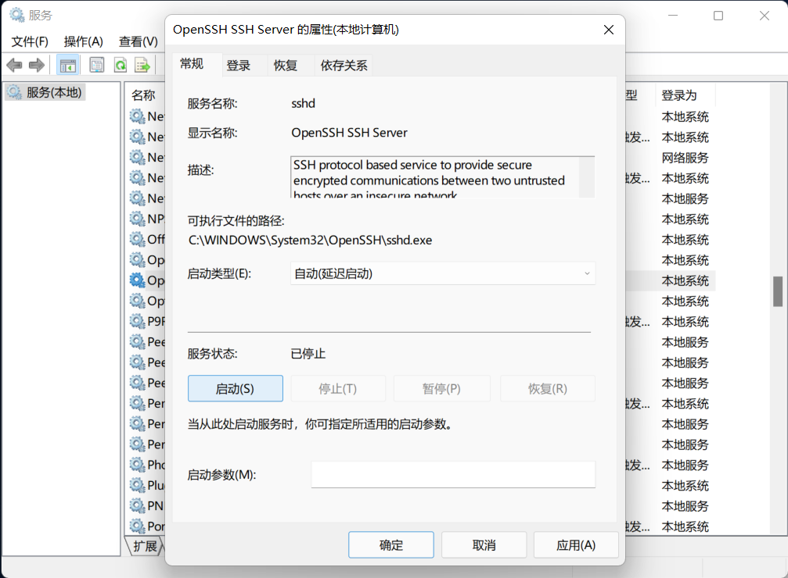